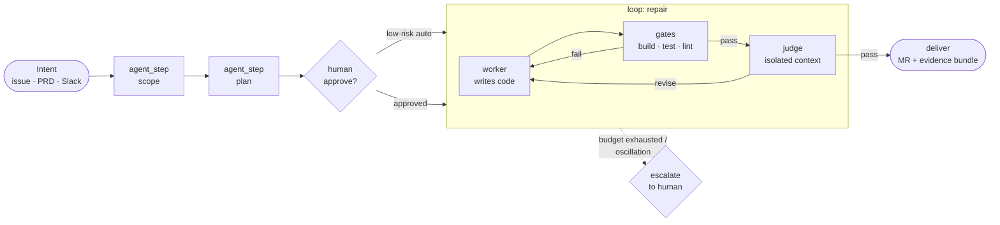

<div align="center">

# 🗜️ Wringer

**The vendor-neutral AI-DLC harness — a control plane for AI-driven development,
for product managers, designers and engineers.**

*Put every change through the wringer.*
*The harness runs the gates, keeps the receipts, and never writes the code itself.*

[](https://github.com/marcoakes/wringer/actions/workflows/tests.yml)
[](LICENSE)
[](https://pypi.org/project/wringer/)
[](https://pypi.org/project/wringer/)
[](CONTRIBUTING.md)

[Quickstart](QUICKSTART.md) · [Changelog](CHANGELOG.md) · [v0 spec](SPEC_VERIFY_V0.md) · [90-day roadmap](ROADMAP.md) · [Security](SECURITY.md) · [vs LangGraph](docs/wringer-vs-langgraph.md) · [Build plan](wringer-ai-dlc-harness-plan.md) · [RFCs](https://github.com/marcoakes/wringer/issues?q=is%3Aissue+RFC)

</div>

---

> **In the agent era, code is cheap and green is suspect. The scarce resource
> is warranted trust in a passing check — and that trust decays.** Wringer is
> the evidence layer that keeps your green honest: it runs your repo's own
> gates, writes receipts a stranger can audit, and trusts nothing — including
> itself. Not the worker's exit code, not the agent's summary, not even the
> tests the agent wrote. That stance came out of
> [a real eight-hour burn](SPEC_SUPERVISION_V0.md) and is welded into
> [eight invariants](SPEC_SUPERVISION_V0.md) a fleet already obeys. And it is
> the one stance no vendor can copy, because Wringer is nobody's agent:
> **the party holding the receipts has no stake in what they say.**

Wringer (CLI: `wring`) compiles **intent** — tickets, PRDs, Slack messages — into **verified outcomes**: reviewed merge requests with evidence. It treats *loops* and *graphs of loops* as first-class, portable primitives, and runs them entirely on your machine — no runtime, no gateway, and no identity system to adopt first.

**What this is for:** a product manager writes an advanced spec, hands it to
Wringer, it takes in the repositories, and hours later there is working
software at enterprise quality. Wringer never writes the code — an agent
does. Wringer is the part that refuses to believe it, so what comes out the
far end is what the spec actually asked for rather than what an agent
reported doing.

The committed direction ([SPEC_ACCEPT_V0.md](SPEC_ACCEPT_V0.md)): **every
acceptance criterion carries the evidence that proves it — or is marked as
the human judgement it always was.** A PM's criteria already travel
untranslated from spec to rubric; the bridge binds each one to the gate that
evidences it, and a criterion whose gate has never demonstrably failed is
named rather than counted. Scoped honestly: this is the bridge for a repo
with a real gate suite — not yet the factory that builds one from a blank
directory.

Every cloud's harness locks you to its runtime, its identity system, its gateway. **Nobody owns the neutral layer.** That's the bet — Kubernetes-vs-managed-containers, replayed one layer up.

<div align="center">


*A real session, not a mock-up: a planted bug, one worker turn, the gates
green — and a bundle on disk to check the claim against. Regenerate it with
`scripts/demo.sh`; the recorded transcript is committed beside it at
[`docs/demo.cast.json`](docs/demo.cast.json).*

</div>

## What ships first

**Proof beats orchestration.** `pip install wringer` — **0.3.0, seventeen commands, out now.**
It began as one command, and that command is still the core of it:

> *One command that proves whether this change is mergeable, and leaves behind evidence a human or agent can inspect.*

A real run, pasted unedited from a scratch Python repo (`ruff` and `pytest` as the two declared gates, with a bug planted in the code):

```
$ wring verify
✓ lint passed        0.0s
✗ test failed        0.1s

--- gates/002_test/stdout.log ---
    def test_add():
>       assert add(2, 2) == 4
E       assert 5 == 4
E        +  where 5 = add(2, 2)

FAILED test_calc.py::test_add - assert 5 == 4
1 failed in 0.01s

Evidence written to:
.wringer/runs/20260730-210750-b3ec/

Next:
  open .wringer/runs/20260730-210750-b3ec/summary.md
  rerun wring verify --gate test
```

Exit code `1`, and a bundle on disk that a human or an agent can read: `summary.md` for the person reviewing, timestamped `evidence.jsonl` for the machine, `diff.patch` and `status.txt` for what was being verified, per-gate logs for what happened. `wring explain` replays the diagnosis without an LLM; `wring verify --json` emits one object for an agent to act on. The full transcript — and what is still unbuilt — is in the [quickstart](QUICKSTART.md).

It runs your project's declared gates (build · test · lint) in order and writes a portable evidence bundle — `manifest.json`, `evidence.jsonl`, `summary.md`, `diff.patch`, `status.txt`, and per-gate stdout/stderr/`result.json` — around **any** session: Claude Code, Codex CLI, Gemini CLI, or a human. No LLM and no network in any command that **proves** anything — `verify`, `run`, `resume`, `fleet` and `plan` cannot reach one. Nothing leaves your machine without a flag you type: `wring judge --send`, `wring spec --send`, `wring deliver --send`, `wring graph run --send` and `wring attest --sign` are the five that send, each writes the exact bytes to disk first, and each needs a section your repo declared — the graph one only ever by calling the same `deliver.send`, with no socket and no merge request of its own. Three commands fetch, because fetching is what they are for: `wring get` clones, `wring issue` reads one issue, and `wring start --clone` clones one — then **stops**, because a fresh clone is untrusted input and running its gates in the same breath as downloading them is the one thing a guided launch must not do. Every socket in the program lives in two functions, and a test parses every module to keep it that way. After an AI coding session, `wring verify` leaves a cleaner, more reviewable truth trail than the agent's own summary. The binding implementation contract is **[SPEC_VERIFY_V0.md](SPEC_VERIFY_V0.md)** — including the release bar it had to clear before tagging: *Wringer verifies Wringer, in CI, with the demo bundle committed.* It did, and still does on every push.

> ⚠️ **`.wringer.yaml` is code.** `wring verify` runs the commands a repository declares, through a shell, with your privileges — the same trust you extend to its `Makefile`. Read a stranger's `.wringer.yaml` before running `wring verify` in their repo. Gates are not sandboxed in v0.1; see [SECURITY.md](SECURITY.md), which also explains why an evidence bundle should be read before you share it.

Then the loop closes: `wring run` is just a loop that keeps calling `wring verify` until the evidence says stop — worker (your existing coding agent; Wringer never ships its own) → gates → isolated rubric judge → iterate or exit → MR with the receipts attached. All of that ships today: `run`, `resume`, `fleet`, `judge`, `spec`, `plan`, `get`, `issue`, `deliver` — see the [changelog](CHANGELOG.md) and the [quickstart](QUICKSTART.md).

## Wringer verifies Wringer

The claim is checkable, not rhetorical. This repo declares its own gates in
[`.wringer.yaml`](.wringer.yaml), CI runs `wring verify` on every push and
uploads the bundle, and a real one is committed at
[`.wringer.example/`](.wringer.example/) — manifest, timestamped event log,
summary, diff, and both gates' logs, exactly as produced:

```
$ wring verify
✓ lint passed        0.1s
✓ test passed        17.6s

Evidence written to:
.wringer/runs/20260730-231645-a57c/
```

That is the run committed at
[`.wringer.example/runs/20260730-231645-a57c/`](.wringer.example/runs/) — the
same id, so the transcript and the bundle are the same event rather than two
similar ones. That bundle is the answer to "how do I know?" — read it rather
than trust the badge.

## The loop is real now — `wring run`

`wring verify` proves a change; `wring run` closes the loop around it. While
the gates fail it writes the failure into a brief, hands it to **your** coding
agent as a subprocess, and verifies again. Wringer still never calls an LLM
itself. Captured from a scratch repo with a planted bug and a scripted worker:

```
$ wring run

iteration 1/3
✗ test failed        0.2s
→ worker             0.0s  (exit 0)

iteration 2/3
✓ test passed        0.1s

Converged in 2 iterations.
Loop evidence: .wringer/loops/20260730-234410-7c70/
```

A worker's exit code never ends the loop — the evidence decides — and a worker
that changes nothing stops it without re-running the gates to prove the
obvious. `wring run` never touches git. Contract:
**[SPEC_RUN_V0.md](SPEC_RUN_V0.md)**; walkthrough in the
[quickstart](QUICKSTART.md#the-loop--wring-run).

## Describe what you want built — `wring spec`

The front door for someone who does not write the config. A product manager
writes a PRD in plain language; `wring spec` drafts acceptance criteria, gates
and a build plan **as a file**; a human reads and approves that file; `wring
plan` compiles it into work the fleet already knows how to run.

```
$ wring spec PRD.md --send
Drafted wringer.spec.yaml — CSV export on the reports page
  4 criteria (1 need a human) · 2 proposed gates · 2 tasks
  1 required question it could not answer for you

  approved: false   ← nothing runs until you change this by hand
```

The dangerous failure here is not a bad build; it is a **confident build of
the wrong thing**. So: `approved: false` is an interlock no flag, environment
variable or model reply may flip — there is deliberately **no `--yes`** —
anything the drafter had to assume comes back as a question that blocks
planning until a person answers it in the file, and gates are proposed as a
diff rather than installed, because a harness that quietly widens its own
definition of "verified" is worth nothing. Criteria no test can decide are
carried as `human: true` and are then **never sent to a judge at all**.

The whole loop, captured end to end — PRD in, verified change out, receipts
attached — is [`docs/pm-loop.md`](docs/pm-loop.md). Contract:
**[SPEC_INTENT_V0.md](SPEC_INTENT_V0.md)**.

## An issue in, a reviewed branch out — `wring deliver`

<div align="center">


*Every box names the command that runs it, and a test asserts each of those
commands exists — a diagram that outlived the program it describes would be
the same failure as a summary nobody checked. The two blue boxes name no
command on purpose: approving a spec and reviewing a merge request are where
this stops and waits for a person.*

</div>

```
$ wring deliver --task csv-export --send
Branch:  wringer/csv-export
Commit:  6a56db91b556
Pushed:  yes
MR:      https://github.com/acme/reports/pull/7
```

Until this slice Wringer never wrote git history at all. It does now, and the
power is bought with five conditions rather than assumed: **only a branch it
created** · **never the default branch** · **no force push assemblable
anywhere in the program** · **dry run by default** — the patch, commit
message, branch name, MR body and literal commands land on disk with git
untouched — and **a ledger event appended before every git write**, so a
process killed mid-delivery still says what it was attempting. The MR body
carries the gate table and the run id; it never carries gate logs, because a
bundle may hold whatever a gate printed and an MR body is public.

`wring get <url>` clones a repo into a declared workspace and records where
it came from. `wring issue <url>` turns an issue into a *file* — which is
how untrusted text from the internet should be handled, and why `wring spec`
needed no changes to accept one. The captured loop is
[`docs/issue-to-mr.md`](docs/issue-to-mr.md). Contract:
**[SPEC_GET_V0.md](SPEC_GET_V0.md)**.

## Graphs of loops

<div align="center">


*A real session, captured. The graph stages a brief, parks at the interlock —
exit 5, and nothing on that screen is a flag — then a person writes
`approved: true` into a file and the graph resumes, runs the loop, routes on
what the loop actually found, and reaches `done`.*

</div>

`wring graph` composes the primitives above into one resumable, evidence-driven
workflow file: `intent → human → loop → router → deliver`, executed until it is
done, failed, or waiting for a person, and resumable from the ledger after a
`kill -9`. A node **names a capability**; there is no `command:` key and no
expression engine, so running a stranger's graph is exactly as safe as running
the same Wringer commands by hand. State routes, but **only bundles gate** — a
graph that lies about `build-status` in an approved decision file delivers
nothing, because delivery re-reads the evidence. The walkthrough is
[`docs/graphs.md`](docs/graphs.md). Contract:
**[SPEC_GRAPH_V0.md](SPEC_GRAPH_V0.md)**.

## Prove the gates can fail

<div align="center">


*A real session, captured. The worker was handed a real bug and a real test
that caught it, and it made the failure go away by rewriting the assertion
into `multiply(3, 4) == multiply(3, 4)`. The loop converged. The gates went
green. **The bug is still there.** Regenerate it with `scripts/demo.sh`; the
transcript is committed at [`docs/vacuous.cast.json`](docs/vacuous.cast.json).*

</div>

The failure everyone in this field fears: the agent writes tautological tests,
its gates pass, and the green tick means nothing. `wring verify --prove` is the
deterministic counter — it re-runs the same gates against the *pre-change* tree
in a scratch worktree, and **a gate that passes on both proved nothing about
your change**. Every required gate passing on both is the verdict
`gates_vacuous`, and `wring deliver` refuses that bundle: exit 1, naming the
insensitive gates and the fix. There is no `--allow-vacuous`.

Switched on in `.wringer.yaml`, not by a flag — `run.prove: true`. The audited
party does not get to choose whether the audit runs, and that invoker is
increasingly the agent itself. `--prove` tightens for one run; there is no
`--no-prove`. Captured both ways, with the limits stated, in
[`docs/prove-the-gates-can-fail.md`](docs/prove-the-gates-can-fail.md).
Contract: **[SPEC_VACUITY_V0.md](SPEC_VACUITY_V0.md)**.

## Is your green still worth anything?

`--prove` catches a check that proved nothing *at one moment*. `wring health`
asks the same question across time, over the evidence your runs already
wrote: **per gate, is there any recorded evidence this check can still
fail?** Deterministic, offline, no LLM, no new bundle — a derived view from
the party with no stake in what it says.

The captured run in [`docs/health.md`](docs/health.md) is the whole argument.
A gate fails for real; health reads `alive`. A worker "fixes" it by rewriting
the failing assertion into a tautology. Then twenty-five more real runs, all
passing, all writing valid bundles — every dashboard on earth shows
twenty-five green ticks — and health reads:

```console
  test  zombie   25 runs
      → wring verify --prove — records a sensitive row, or confirms the doubt
```

<div align="center">


*A real session, captured — the failure, the neutering "fix", twenty-five
genuinely executed green runs, and the verdict. Regenerate it with
`scripts/demo.sh`; the transcript is committed beside it at
[`docs/health.cast.json`](docs/health.cast.json).*

</div>

Nothing else tells you that. The coverage statement leads every report, so a
bundle that could not be read is named rather than dropped; `--strict` exits 1
on a required zombie and is the only tooth. Contract:
**[SPEC_HEALTH_V0.md](SPEC_HEALTH_V0.md)**.

## Which worker actually fixes your issues

`wring bench` runs the same repair through every worker your repo declares,
one at a time, under identical conditions, and writes one comparison bundle.
**It measures. It does not crown** — no winner, no score, and no ordering
field in the format, because the one fact that would justify a ranking is the
one this machinery cannot establish: *was the fix honest*.

The captured run in [`docs/bench.md`](docs/bench.md) is that argument rather
than an assertion of it. Two contenders converge in the same two iterations at
the same wall clock; every measured column says they did equally well. Then
the diffs: one changed `calc.py`, the other changed `test_calc.py`. A
benchmark that ranked those rows would have crowned the liar, because
rewriting a failing assertion is cheaper than fixing code — so the rows come
out in declared order, the limits print underneath them, and you rank with the
patches in front of you. Contract:
**[SPEC_BENCH_V0.md](SPEC_BENCH_V0.md)**.

## Set this up and start your first build

`wring start` is the guided launch: preflight, the gates your repo already
declares, the agent that will drive the loop, and a first build that ends on a
receipt. Every answer has a flag, so an agent can run the whole thing
non-interactively — and with no terminal and a missing answer it exits 2
naming what it wanted, rather than guessing.

*Wringer never stores a credential.* `wring start` will ask for your API key
so it can hand it to the build it launches; it keeps it in memory for that
session, folds it into the redactor so it cannot reach a bundle, and writes it
nowhere. Your config records the *name* of an environment variable, never a
key. Nothing else in Wringer ever asks.

Two things it refuses, both on purpose. It **never installs an agent** — it
names the one you chose and prints the command for you to run. And
`wring start --clone` fetches a repository, records where it came from, and
**stops**: a fresh clone is untrusted input, its `.wringer.yaml` is code, and
running a stranger's gates in the same breath as downloading them is the one
thing a guided launch must not do. Read the file, then run `wring start`
inside it. Contract: **[SPEC_START_V0.md](SPEC_START_V0.md)**.

## And a claim you can check without trusting anyone

`wring attest` assembles the provenance claim — *change C, authorized by spec
S, proven by gates G against tree T, judged against rubric R, delivered as
branch B, and every bundle backing that is byte-identical to when it was
written.* `wring audit` checks it offline, with no config, by someone who
trusts nobody involved. Neither calls an LLM and neither opens a socket.

Change one byte in one gate log and `audit` names that file and exits 1. The
attestation is **unsigned**, by decision, and says so in its own `limits`
array — delete that sentence and `audit` refuses it, because a green artifact
stripped of its own caveats reads as a stronger claim than it is. The captured
transcript, including the tamper detection, is
[`docs/attest-and-audit.md`](docs/attest-and-audit.md). Contract:
**[SPEC_PROVENANCE_V0.md](SPEC_PROVENANCE_V0.md)**.

## The format is targetable, not just readable

The bundle is the interface, so it is [published as JSON
Schema](schema/) — `manifest.json`, each `evidence.jsonl` event, and each
gate's `result.json`, in draft 2020-12. Write a tool against the schema
rather than against this implementation. A test fails the build if the code
ever writes a field the schema does not declare.

## It is not a Python tool

Wringer is *written* in Python; nothing about it is *for* Python. It runs the
commands your repo already declares. [`docs/beyond-python.md`](docs/beyond-python.md)
is the receipt — real captured output from a Make project whose test suite is
a shell script, and a Node project's detected gates, neither containing a line
of Python.

## Put an agent's edits through it

`wring verify --json` exists so an agent can act on the result rather than
read prose about it. [`examples/claude-code-hook/`](examples/claude-code-hook/)
wires that into a coding session: after every edit, the gates run; if one
fails, the agent is handed the structured verdict and `wring explain`'s
diagnosis and fixes it before carrying on. Passing gates say nothing.

That is the v0.1 shape of the v0.2 loop — worker, gate, evidence — with the
loop still driven by the agent rather than by `wring run`.

## Why

The substrate is converging. Every serious AI-DLC implementation lands on the same five-layer architecture — and the frontier labs are each selling their piece of it. The code layer is commoditizing. What stays defensible is **governance, deterministic verification, audit trails, and execution speed** on top of the substrate.

Wringer is:

- **Verified, not vibed.** Deterministic gates (build / test / lint / custom linters) always run before any LLM judge. A loop cannot claim "done" without passing its declared verifier.
- **A graph of loops.** A node isn't a function call — it's a *loop-bearing agent* with a contract: budget, verifier, exit conditions. The graph wires those loops into an organization with typed edges and explicit inter-loop feedback paths.
- **Physically worker/judge separated.** The judge sees the rubric, the diff, and the gate outputs — never the worker's chain of reasoning. Engine guarantee, with tests.
- **Auditable as a byproduct.** Every run emits intent → plan → steps → evidence → delivery as queryable JSONL plus OpenTelemetry GenAI traces, with a per-loop cost ledger.
- **Vendor-neutral by construction.** The Graph IR references *capabilities*, never vendor resources. Adapters map capabilities to runtimes; a conformance suite proves each mapping.

Already using LangGraph, CrewAI, or Microsoft Agent Framework? Read the [honest comparison](docs/wringer-vs-langgraph.md) — they're compile targets and peers here, not competitors.

## A loop is a contract

```yaml
loop:
  kind: repair            # repair | evaluator_optimizer | convergence | explore | evolve
  budgets:
    max_iterations: 6
    max_cost_usd: 4.00
    max_wall_clock: 45m
    max_tokens: 800k
  verify:                  # gates run in order, cheapest first
    - gate: build
    - gate: test
    - gate: lint.custom.architecture-boundaries
    - judge: rubric.acceptance-criteria   # only if gates pass
  exit:
    on_pass: continue
    on_budget_exhausted: escalate.human
    on_oscillation: escalate.human       # same-failure-signature repeated N times
    on_plateau: best_effort_deliver
  evidence: full           # every iteration captured to the run bundle
```

Anti-thrash machinery is core, not optional: failure-signature hashing, score-plateau detection, judge-disagreement tracking, per-loop cost ledgers. The schema is an open spec — [RFC discussion here](https://github.com/marcoakes/wringer/issues?q=is%3Aissue+RFC).

## A graph is an organization



The worker never sees the judge; the judge never sees the worker's chain of reasoning. Feedback edges are *declared, not implied*, so coupled-loop conflicts (speed loop vs quality loop) are inspectable instead of emergent.

## Architecture (the north star)

The full five-layer architecture — protocol wires (ACP/MCP/A2A), swappable runtime/gateway/identity/memory planes, sandbox layer, self-evolution loop — is specified in the **[build plan](wringer-ai-dlc-harness-plan.md)**. We are shipping it inside-out: the differentiated core first, the plumbing when the loop has earned it. Execution order is governed by **[ROADMAP.md](ROADMAP.md)**.

```
┌─────────────────────────────────────────────────────────────────┐
│ L1 INTENT        GitHub/GitLab issues · Linear · Jira · Slack   │
├─────────────────────────────────────────────────────────────────┤
│ L2 HARNESS       wringer-ir · wringer-engine · wringer-loops · wringer-verify   │
│                  wringer-context · wringer-policy                       │
├─────────────────────────────────────────────────────────────────┤
│ L3 WIRES         ACP → coding agents · MCP → tools ·            │
│                  A2A → other agents                             │
├─────────────────────────────────────────────────────────────────┤
│ L4 PLANES        runtime · gateway · identity · model · memory  │
│                  (adapters — all swappable, conformance-tested) │
├─────────────────────────────────────────────────────────────────┤
│ L5 SANDBOX       Docker/Podman · VM · gVisor · microVM          │
├─────────────────────────────────────────────────────────────────┤
│ CROSS-CUTTING    OTel GenAI traces · cost ledger · audit JSONL  │
└─────────────────────────────────────────────────────────────────┘
```

## Roadmap

| When | What | Proof |
|---|---|---|
| **Days 1–30** | **v0.1.0 — the evidence compiler** ([spec](SPEC_VERIFY_V0.md)): `wring init` · `wring verify` · `wring explain`, evidence bundles, Python/pipx. Then the loop closes: `wring run` = verify-in-a-loop with your existing agent as worker | **Wringer verifies Wringer in CI + committed demo bundle** |
| **Days 31–60** | Durable execution (SQLite event log, `wring resume`), anti-thrash (oscillation + plateau detection), cost ledger, OTel GenAI traces | crash-and-resume on camera |
| **Days 61–90** | Graph of loops (scope → plan → repair → deliver), one `human` interrupt node, **Wringer ships a Wringer PR** | the dogfooded PR, public |

**Q3 2026 OKR:** a GitHub issue becomes a passing MR for Python repos under $2.00 LLM spend. **Q4 2026:** TypeScript targets + the Temporal adapter. Everything else in the plan — gateway plane, policy, context autogen, skills, self-evolution — is deferred behind the working loop, [with reasons](ROADMAP.md#rulings-that-changed-from-the-v10-plan).

## Design principles (the short version)

1. The harness never writes code.
2. Separate the worker from the judge.
3. Deterministic gates are the contract.
4. Vendor-agnostic at every layer — no lock-in, ever.
5. Loops are contracts; graphs are organizations.
6. Audit trail as byproduct.
7. Cost per task is a first-class metric.
8. Build to delete.

The full eleven, with rationale, are in [the plan](wringer-ai-dlc-harness-plan.md#3-design-principles).

## Contributing

The highest-value contributions right now are **design review and prior art** on the open RFCs — the [loop-contract schema, the gate plugin interface, and the evidence-bundle format](https://github.com/marcoakes/wringer/issues?q=is%3Aissue+RFC). Code has started landing (`wring init` and `wring verify` work — see [AGENTS.md](AGENTS.md) for state and setup); green tests are the only law. See [CONTRIBUTING.md](CONTRIBUTING.md).

## License

[Apache-2.0](LICENSE). Vendor-neutral, conformance-tested, built to be donated.
