<div align="center">


# 🗜️ Wringer

## Your tests passed. Prove they could have failed.

**Offline. No LLM. It refuses the merge when they couldn't.**

*A gate that passes on the code before your change proved nothing about your
change. Wringer runs your own gates against both trees and tells you which
ones could not tell them apart.*

**Works with what you already run — any coding agent you can start from a terminal,
any model behind an OpenAI-compatible endpoint** ([measured, per vendor](docs/vendors.md)).
**[Enforced, not instructed](docs/enforced-vs-instructed.md):** other harnesses tell a model to
audit its own completion; Wringer records the check red before the work, green after, and refuses.

[](https://github.com/marcoakes/wringer/actions/workflows/tests.yml)
[](LICENSE)
[](https://pypi.org/project/wringer/)
[](https://pypi.org/project/wringer/)
[](CONTRIBUTING.md)

[Quickstart](QUICKSTART.md) · [Changelog](CHANGELOG.md) · [v0 spec](docs/specs/SPEC_VERIFY_V0.md) · [90-day roadmap](ROADMAP.md) · [Security](SECURITY.md) · [vs LangGraph](docs/wringer-vs-langgraph.md) · [Build plan](docs/ARCHITECTURE-NORTHSTAR.md) · [RFCs](https://github.com/marcoakes/wringer/issues?q=is%3Aissue+RFC)

</div>

---

> **In the agent era, code is cheap and green is suspect. The scarce resource
> is warranted trust in a passing check, and that trust decays.** Wringer is
> the evidence layer that keeps your green honest: it runs your repo's own
> gates, writes receipts a stranger can audit, and trusts nothing, including
> itself. Not the worker's exit code, not the agent's summary, not even the
> tests the agent wrote. That stance came out of
> [a real eight-hour burn](docs/specs/SPEC_SUPERVISION_V0.md) and is welded into
> [eight invariants](docs/specs/SPEC_SUPERVISION_V0.md) a fleet already obeys. And it is
> the one stance no vendor can copy, because Wringer is nobody's agent:
> **the party holding the receipts has no stake in what they say.**

**The larger goal this serves**, so that a window reading this file does not
lose it: a product manager writes an advanced spec, points Wringer at the
repositories, and hours later there is working software at enterprise quality
— Wringer never writing the code, only refusing to believe it is done.
That surface has its own front page: **[README-PM.md](README-PM.md)**.

**A gate that cannot fail is not a gate.** Wringer runs your repository's own
checks against the tree *before* your change as well as the tree after it. A
required gate that passes on both did not discriminate — it proved nothing
about what you are merging, and Wringer says so by name.

That is the whole idea, and it has a vocabulary already:

- a **vacuous** gate passed on both trees, so it decided nothing here;
- a gate's **vitality** is whether the record shows it can still fail at all;
- a **zombie** is a check that has been green so long nobody has seen it red,
  and nobody would notice if it stopped testing anything.

Everything else in this repository — the loop, the graph, the spec surface,
the board — is built on that one measurement. **You do not need any of it to
use the measurement.**

**It is not a CI tool.** CI runs your checks; Wringer proves a check *could
have failed*, and refuses the delivery when it could not.

> **Not an engineer?** There is a separate front page for the surface a
> product manager touches — prose in, a plan you approve, a page showing what
> was built and what proves it: **[README-PM.md](README-PM.md)**.

## Where this actually is: the seven moments, labelled honestly

| | the moment | what exists today |
|---|---|---|
| **1** | **You write it down.** Prose in (a PRD, a doc, a pasted brain-dump), and it comes back as a list of requirements, each with the check that will decide it, plus the questions it could not answer for you. | **Built**: `wring spec` drafts criteria, gates and the `proves:` bindings ([docs/specs/SPEC_INTENT_V0.md](docs/specs/SPEC_INTENT_V0.md)). **Direction**: today that list is a YAML file, and the conversation that resolves the questions is a hand edit. |
| **2** | **Nothing runs until you approve it.** You read what will be built and how each piece will be proved, and you say yes. | **Built**, and it is an interlock rather than a setting: `approved: false` is flipped by a person, there is deliberately **no `--yes`**, and unanswered required questions block planning. **Built 2026-08-17**: `wringer-board plan` renders the plain-language plan and `wringer-board approve` writes `approved: true` after printing it, so there is no path that approves without rendering. Byte-identical to the hand edit. |
| **3** | **The work happens without you.** | **Built**: `wring run`, `wring fleet` and `wring graph`, giving the loop, bounded concurrency, and resumption from a ledger after a `kill -9`. |
| **4** | **One page tells you what is done, and shows the proof.** Every green shows the same check recorded failing before the work. | **Built, in two halves.** The record it renders is `acceptance.json`, in which every criterion carries the evidence that proves it or is marked as the human judgement it always was ([docs/specs/SPEC_ACCEPT_V0.md](docs/specs/SPEC_ACCEPT_V0.md)). The page itself is a separate layer (see [the board](#the-board--one-page-a-product-manager-can-read)) and it is **public and live** at <https://marcoakes.github.io/wringer-board/>. |
| **5** | **You look at the thing itself.** A requirement about a screen shows you the screen. | **Built, engine half, 2026-08-17**: a gate can opt in to `artifacts:`, is handed a directory, and what it leaves is recorded in a `wringer.gate-artifacts.v1` sibling: name, size, digest, media type, and *no caption, no label, no meaning*. **Direction**: the board rendering them. And one limit stated rather than discovered: **a binary artifact is not redacted**, which is why it is opt-in per gate. |
| **5a** | **A requirement only a person can judge waits for that person.** | **Built 2026-08-17**: a required `human: true` criterion that nobody has answered, or that was answered against wording since changed, REFUSES the delivery. A person writes `wringer.judgements.yaml` by hand; there is no flag, no `--judge`, and nothing in either repository writes it for them. |
| **6** | **Your "no" becomes a new check.** You say "that is not what I meant"; the correction becomes a requirement with a check shown failing today, so the next round cannot quietly undo it. | **Built, engine half**: a criterion becomes a proposed gate that goes through a human diff and is recorded RED before any work begins ([docs/specs/SPEC_GATEGEN_V0.md](docs/specs/SPEC_GATEGEN_V0.md)), and the repair loop stays open while such a check is red. **Direction**: the surface verb that turns a complaint into that criterion. |
| **7** | **The handover waits rather than going out anyway.** | **Built**: `wring deliver` refuses on named conditions and there is no flag to wave one through. **Direction**: those refusals reaching you in plain language instead of as an exit code. |

**And one gap that is not a moment, named because it is the biggest one
left:** getting to moment 1 still means installing a CLI, shaping a config
file and typing commands. A single verb that takes a prose file and drives
the whole chain, with the setup generated rather than hand-written, is
specified as the next cycle but one, and is direction, not a claim. The queue
is in [ROADMAP.md](ROADMAP.md).

## The part most projects would leave out

**This programme made a claim, wrote down the numbers that would decide it in
advance, tested it, lost, and withdrew the claim the same day.** In August 2026
Wringer claimed that for *bug fixes* it could author a reproduction check from
a written requirement and prove it red before the work. One pass over thirteen
real upstream bug fixes, both arms, $53.34: the check was authored and proved
red on 11 of 13, it refused one genuinely wrong change that upstream agrees was
wrong — and it also passed two changes upstream's own tests reject, and refused
two it accepts. Three of six pre-registered clauses missed. The claim came out
of this README automatically, on a trigger set before the run, and no release
rides on it.

The numbers are in [`docs/corpus-2026-08-16.md`](docs/corpus-2026-08-16.md),
including a postscript correcting something the capture itself got wrong. The
retreat is further down this page, dated, in the place the claim used to be.
**Read that before you believe anything else here** — it is the only evidence
on offer that the rest of these claims are the kind that get withdrawn when
they fail.

The positioning is a triple and each leg was measured against a different
competitor's tree: **enforced not instructed** (OpenAI's Codex grades itself
against a prompt), **executed not judged** (LangChain's deepagents ships a
grader with read-only tools that cannot run a check), and **a refusal rather
than exit 0** (both exit 0 either way) — [the measurements, and what happens
to this claim when they close the gap](docs/enforced-vs-instructed.md).

Every cloud's harness locks you to its runtime, its identity system, its gateway. **Nobody owns the neutral layer.** That's the bet — Kubernetes-vs-managed-containers, replayed one layer up.

<div align="center">



*A real session, not a mock-up: a planted bug, one worker turn, the gates
green — and a bundle on disk to check the claim against. Regenerate it with
`scripts/demo.sh`; the recorded transcript is committed beside it at
[`docs/demo.cast.json`](docs/demo.cast.json).*

</div>

## What ships first

**Proof beats orchestration.** `uv tool install wringer` — **0.8.10, nineteen commands, out now.**
It began as one command, and that command is still the core of it:

### Not an engineer? Ask your coding agent to install it

**[INSTALL.md](INSTALL.md) is one prompt you paste into whatever coding agent
you already use** — Claude Code, Codex, Gemini CLI, Cursor, any of them. It
installs Wringer and the board, then has your agent build a three-file project
on your machine and show you the same requirement twice: once refused, and once
**proved, with the words "It was red first"** underneath it.

No sudo, no system changes, and **it never asks you for a key** — the one
credential step is optional, at the end, and your operating system prompts for
it with the input masked. Every step of that prompt was
[executed in a clean environment](docs/install-2026-08-17.md) before it
shipped, and running it found three defects that reading it had not.

> **What the package is, as of 2026-09-01.** `0.8.10` is the released
> version, and unlike every version before 0.4.0, it is **one package**: the
> engine, the requirements board and the drive verb all ship inside the
> `wringer` distribution. `uv tool install wringer` gets all three.
> `0.8.10` registers nineteen commands, derived from the tag by
> `tests/test_docs.py` rather than kept by hand.
>
> This paragraph used to say the opposite — that the release was behind
> the repository and a reader should install from source instead. It said
> so for two days after the release was cut, because nothing tied the
> sentence to the tag. A product manager hit it on 2026-08-22 and was
> sent down a source install that then errored. The guard in
> `tests/test_docs.py` now reads the latest PUBLISHED tag and fails when
> this page disagrees with it, in either direction.

> *One command that proves whether this change is mergeable, and leaves behind evidence a human or agent can inspect.*

A real run, pasted unedited from a scratch Python repo (`ruff` and `pytest` as the two declared gates, with a bug planted in the code):

```
$ wring verify
✓ lint passed        0.0s
✗ test failed        0.1s

--- gates/002_test/stdout.log ---
    def test_add():
>       assert add(2, 2) == 4
E       assert 5 == 4
E        +  where 5 = add(2, 2)

FAILED test_calc.py::test_add - assert 5 == 4
1 failed in 0.01s

Evidence written to:
.wringer/runs/20260730-210750-b3ec/

Next:
  open .wringer/runs/20260730-210750-b3ec/summary.md
  rerun wring verify --gate test
```

Exit code `1`, and a bundle on disk that a human or an agent can read: `summary.md` for the person reviewing, timestamped `evidence.jsonl` for the machine, `diff.patch` and `status.txt` for what was being verified, per-gate logs for what happened. `wring explain` replays the diagnosis without an LLM; `wring verify --json` emits one object for an agent to act on. The full transcript — and what is still unbuilt — is in the [quickstart](QUICKSTART.md).

It runs your project's declared gates (build · test · lint) in order and writes a portable evidence bundle — `manifest.json`, `evidence.jsonl`, `summary.md`, `diff.patch`, `status.txt`, and per-gate stdout/stderr/`result.json` — around **any** session: Claude Code, Codex CLI, Gemini CLI, or a human. No LLM and no network in any command that **proves** anything — `verify`, `run`, `resume`, `fleet` and `plan` cannot reach one. Nothing leaves your machine without a flag you type: `wring judge --send`, `wring spec --send`, `wring deliver --send`, `wring graph run --send` and `wring attest --sign` are the five that send, each writes the exact bytes to disk first, and each needs a section your repo declared — the graph one only ever by calling the same `deliver.send`, with no socket and no merge request of its own. Three commands fetch, because fetching is what they are for: `wring get` clones, `wring issue` reads one issue, and `wring start --clone` clones one — then **stops**, because a fresh clone is untrusted input and running its gates in the same breath as downloading them is the one thing a guided launch must not do. Every socket in the program lives in two functions, and a test parses every module to keep it that way. After an AI coding session, `wring verify` leaves a cleaner, more reviewable truth trail than the agent's own summary. The binding implementation contract is **[docs/specs/SPEC_VERIFY_V0.md](docs/specs/SPEC_VERIFY_V0.md)** — including the release bar it had to clear before tagging: *Wringer verifies Wringer, in CI, with the demo bundle committed.* It did, and still does on every push.

> ⚠️ **`.wringer.yaml` is code.** `wring verify` runs the commands a repository declares, through a shell, with your privileges — the same trust you extend to its `Makefile`. Read a stranger's `.wringer.yaml` before running `wring verify` in their repo. **What bounds that depends on the mode you chose, and the honest answer is a table rather than an adjective**: local execution is `trusted_local` and is not a sandbox; the opt-in container backend has been adversarially attacked in three platform/runtime combinations and the contained worker in three more, with a `--privileged` control for the worker path and none for the gate path; and several surfaces are `unmeasured` and say so. [SECURITY.md](SECURITY.md) carries both tables — what was measured, and what was not — and also explains why an evidence bundle should be read before you share it.

Then the loop closes: `wring run` is just a loop that keeps calling `wring verify` until the evidence says stop — worker (your existing coding agent; Wringer never ships its own) → gates → isolated rubric judge → iterate or exit → MR with the receipts attached. All of that ships today: `run`, `resume`, `fleet`, `judge`, `spec`, `plan`, `get`, `issue`, `deliver` — every one of those names is checked against the real argument parser by `tests/test_docs.py` — see the [changelog](CHANGELOG.md) and the [quickstart](QUICKSTART.md).

## Wringer verifies Wringer

The claim is checkable, not rhetorical. This repo declares its own gates in
[`.wringer.yaml`](.wringer.yaml), CI runs `wring verify` on every push and
uploads the bundle, and a real one is committed at
[`.wringer.example/`](.wringer.example/) — manifest, timestamped event log,
summary, diff, and both gates' logs, exactly as produced:

```
$ wring verify
✓ lint passed        0.1s
✓ test passed        17.6s

Evidence written to:
.wringer/runs/20260730-231645-a57c/
```

That is the run committed at
[`.wringer.example/runs/20260730-231645-a57c/`](.wringer.example/runs/) — the
same id, so the transcript and the bundle are the same event rather than two
similar ones. That bundle is the answer to "how do I know?" — read it rather
than trust the badge.

## The loop is real now — `wring run`

`wring verify` proves a change; `wring run` closes the loop around it. While
the gates fail it writes the failure into a brief, hands it to **your** coding
agent as a subprocess, and verifies again. Wringer still never calls an LLM
itself. Captured from a scratch repo with a planted bug and a scripted worker:

```
$ wring run

iteration 1/3
✗ test failed        0.2s
→ worker             0.0s  (exit 0)

iteration 2/3
✓ test passed        0.1s

Converged in 2 iterations.
Loop evidence: .wringer/loops/20260730-234410-7c70/
```

A worker's exit code never ends the loop — the evidence decides — and a worker
that changes nothing stops it without re-running the gates to prove the
obvious. `wring run` never touches git. Contract:
**[docs/specs/SPEC_RUN_V0.md](docs/specs/SPEC_RUN_V0.md)**; walkthrough in the
[quickstart](QUICKSTART.md#the-loop--wring-run).

## Describe what you want built — `wring spec`

The front door for someone who does not write the config. A product manager
writes a PRD in plain language; `wring spec` drafts acceptance criteria, gates
and a build plan **as a file**; a human reads and approves that file; `wring
plan` compiles it into work the fleet already knows how to run.

```
$ wring spec PRD.md --send
Drafted wringer.spec.yaml — CSV export on the reports page
  4 criteria (1 need a human) · 2 proposed gates · 2 tasks
  1 required question it could not answer for you

  approved: false   ← nothing runs until you change this by hand
```

The dangerous failure here is not a bad build; it is a **confident build of
the wrong thing**. So: `approved: false` is an interlock no flag, environment
variable or model reply may flip — there is deliberately **no `--yes`** —
anything the drafter had to assume comes back as a question that blocks
planning until a person answers it in the file, and gates are proposed as a
diff rather than installed, because a harness that quietly widens its own
definition of "verified" is worth nothing. Criteria no test can decide are
carried as `human: true` and are then **never sent to a judge at all**.

The whole loop, captured end to end — PRD in, verified change out, receipts
attached — is [`docs/pm-loop.md`](docs/pm-loop.md). Contract:
**[docs/specs/SPEC_INTENT_V0.md](docs/specs/SPEC_INTENT_V0.md)**.

## An issue in, a reviewed branch out — `wring deliver`

<div align="center">


*Every box names the command that runs it, and a test asserts each of those
commands exists — a diagram that outlived the program it describes would be
the same failure as a summary nobody checked. The two blue boxes name no
command on purpose: approving a spec and reviewing a merge request are where
this stops and waits for a person.*

</div>

```
$ wring deliver --task csv-export --send
Branch:  wringer/csv-export
Commit:  6a56db91b556
Pushed:  yes
MR:      https://github.com/acme/reports/pull/7
```

Until this slice Wringer never wrote git history at all. It does now, and the
power is bought with five conditions rather than assumed: **only a branch it
created** · **never the default branch** · **no force push assemblable
anywhere in the program** · **dry run by default** — the patch, commit
message, branch name, MR body and literal commands land on disk with git
untouched — and **a ledger event appended before every git write**, so a
process killed mid-delivery still says what it was attempting. The MR body
carries the gate table and the run id; it never carries gate logs, because a
bundle may hold whatever a gate printed and an MR body is public.

### The proof travels — `certificate.md`

A reviewer who never ran the machine used to be told there was a hole and that
the map was not coming. Since `0.5.0` the delivery carries **`certificate.md`**
and **`certificate.json`** beside `mr.md`, plus `coverage.json`,
`falsification.json` and a copy of the board page: every requirement by title
with what the record can honestly say about it, the proved ones named with
their check and where that check is on record failing, and a person's verdict
with their own words. The merge request quotes the same renderer, so the two
cannot drift.

### Two questions a passing suite cannot answer

**How much of what was asked for is even watched?** Since `0.5.1` every run
with an approved spec prints the coverage statement — *N of M requirements
carry a check that can prove them* — and a second line saying what that number
cannot see. It is two sentences and never one, because a bound check can still
test less than the requirement means.

**What could I break that nothing would notice?** `wring verify --falsify`
(since `0.5.2`) takes the change you just made, breaks it on purpose one line
at a time, and re-runs the bound checks against each version. A mutation that
survives is a finding **about the checks**, not about the change: they could
not tell the delivered code from the code with that line broken. No model is
involved — the substitutions come from a fixed table, and the record says so
where the number is.

```
$ wring audit certificate.json
✓ certificate.json — wringer/csv-export, checked against /home/you/reports

  ✓ the counts match the requirements listed below them
  ✓ the requirements listed are the ones this repository declares
  ✓ the commit this was verified at is in this clone
  − the record shows the check for “The export downloads a CSV” failing
      run `20260801-232426-ff99` did not travel with this document, so
      nothing here can look
```

No network, no model, no account, and **it never reads who produced the
branch** — a verification whose answer moved when the author changed would be
a verification of the author. `−` is a third outcome and not a hedge: a claim
whose evidence did not travel has *not* been checked, and calling that a pass
or a failure would be a lie in one of the two directions. Handed a whole
delivery directory, `wring audit --delivery <dir>` does the same check from
any clone that has fetched the delivered branch: it reads
the delivery's own manifest for the commit, checks against a read-only
worktree at that commit, and removes it afterwards — your checkout is not
touched. Contract:
**[docs/specs/SPEC_CERTIFICATE_V0.md](docs/specs/SPEC_CERTIFICATE_V0.md)**.

`wring get <url>` clones a repo into a declared workspace and records where
it came from. `wring issue <url>` turns an issue into a *file* — which is
how untrusted text from the internet should be handled, and why `wring spec`
needed no changes to accept one. The captured loop is
[`docs/issue-to-mr.md`](docs/issue-to-mr.md). Contract:
**[docs/specs/SPEC_GET_V0.md](docs/specs/SPEC_GET_V0.md)**.

## Graphs of loops

<div align="center">



*A real session, captured. The graph stages a brief, parks at the interlock —
exit 5, and nothing on that screen is a flag — then a person writes
`approved: true` into a file and the graph resumes, runs the loop, routes on
what the loop actually found, and reaches `done`.*

</div>

`wring graph` composes the primitives above into one resumable, evidence-driven
workflow file: `intent → human → loop → router → deliver`, executed until it is
done, failed, or waiting for a person, and resumable from the ledger after a
`kill -9`. A node **names a capability**; there is no `command:` key and no
expression engine, so running a stranger's graph is exactly as safe as running
the same Wringer commands by hand. State routes, but **only bundles gate** — a
graph that lies about `build-status` in an approved decision file delivers
nothing, because delivery re-reads the evidence. The walkthrough is
[`docs/graphs.md`](docs/graphs.md). Contract:
**[docs/specs/SPEC_GRAPH_V0.md](docs/specs/SPEC_GRAPH_V0.md)**.

## Prove the gates can fail

<div align="center">



*A real session, captured. The worker was handed a real bug and a real test
that caught it, and it made the failure go away by rewriting the assertion
into `multiply(3, 4) == multiply(3, 4)`. The loop converged. The gates went
green. **The bug is still there.** Regenerate it with `scripts/demo.sh`; the
transcript is committed at [`docs/vacuous.cast.json`](docs/vacuous.cast.json).*

</div>

The failure everyone in this field fears: the agent writes tautological tests,
its gates pass, and the green tick means nothing. `wring verify --prove` is the
deterministic counter — it re-runs the same gates against the *pre-change* tree
in a scratch worktree, and **a gate that passes on both proved nothing about
your change**. Every required gate passing on both is the verdict
`gates_vacuous`, and `wring deliver` refuses that bundle: exit 1, naming the
insensitive gates and the fix. There is no `--allow-vacuous`.

Switched on in `.wringer.yaml`, not by a flag — `run.prove: true`. The audited
party does not get to choose whether the audit runs, and that invoker is
increasingly the agent itself. `--prove` tightens for one run; there is no
`--no-prove`. Captured both ways, with the limits stated, in
[`docs/prove-the-gates-can-fail.md`](docs/prove-the-gates-can-fail.md).
Contract: **[docs/specs/SPEC_VACUITY_V0.md](docs/specs/SPEC_VACUITY_V0.md)**.

**Wringer delivers only on evidence that could have failed** — **for net-new
work**, where a generated gate is red because the feature does not exist yet.
Where no red can be established, Wringer does not guess: the criterion exits
`unevidenced` and a human decides.

> **The bug-fix claim was withdrawn on 2026-08-16, and this is the retreat
> said out loud rather than performed quietly.** Until that date this sentence
> also claimed that for bug fixes Wringer authors a reproduction witness from
> the criterion and proves it red before the work begins. That claim was
> pre-committed to a test — one pass over a 13-task corpus of real upstream bug
> fixes, with the numbers written down in advance — and **it lost**.
>
> It lost on three of six clauses. Two changes passed Wringer's own manufactured
> check and still failed upstream's held-out tests, against a ceiling of one.
> Of three wrong changes on covered rows, one was repaired or refused, against a
> required two thirds. And no row showed the repair loop converting a red
> witness to green.
>
> **The mechanism works and the claim was still too wide.** The witness lane
> did what it says: a check was authored before the work on 11 of 13 tasks,
> proved red for the right reason, pinned so a worker could not edit it, and it
> refused a real wrong change on `marshmallow-constant-required`. What it
> cannot do is tell a change that satisfies the stated criterion from one that
> also matches what the maintainer intended — and on this corpus that gap
> produced two false greens and two false refusals. That limit was written down
> before the pass, not after it: it is the sentence immediately below.
>
> The numbers, the rows and the failure are in
> [`docs/corpus-2026-08-16.md`](docs/corpus-2026-08-16.md). Nothing in the
> calibration captures has been rewritten.

And the ceiling on that claim, which no artifact here may exceed: **a witness
proves the stated criterion could fail and was made to pass; it does not
certify agreement with an unstated intended fix, and where the criterion
under-describes the intent, the witness inherits that gap.**

*Status, 2026-08-16. The net-new half ships and is what the claim above now
covers: `--prove`, the generated gate, and the pre-change red run, all shown
earlier on this page. The bug-fix half was tested and withdrawn — the box above
is that retreat, and the numbers are in
[`docs/corpus-2026-08-16.md`](docs/corpus-2026-08-16.md).*

*What remains of it, stated at exactly its true size: the witness lane is still
in this code, and it is a **measured capability whose wide claim was
withdrawn**, not a supplier of anything this page promises.
`wring spec --send --witness` authors a check from a criterion, `wring run`
proves it red on a pre-change worktree and pins it before the first worker turn,
and a red witness refuses a delivery over a green vacuous gate. It was
calibrated at 12/13 proved red for the right reason and 10/12 green on
upstream's own fix
([`docs/witness-calibration-2026-08-15.md`](docs/witness-calibration-2026-08-15.md)),
and it then covered 11 of 13 rows in the live pass it lost. Nothing here is
built on it: red-first for net-new work is
[docs/specs/SPEC_GATEGEN_V0.md](docs/specs/SPEC_GATEGEN_V0.md)'s path and always was.
[`docs/witness-programme.md`](docs/witness-programme.md) records the phases, the
pre-commitment, and the commit that executed it.*

### Two objections, answered where the claims live

**"Isn't this just tests?"** The difference is *when* a check earns trust and
what is kept afterwards. A check here is proved able to fail before it is
believed: the receipt on a passing criterion cites a run on disk where that same
check — same id, same command — was recorded failing, so you can go and read it.
Edit the command and the history resets, because editing is how checks quietly
narrow. And `wring verify --prove` re-runs the gates against the *pre-change*
tree: every required gate passing on both is `gates_vacuous`, and `wring
deliver` refuses that bundle with no flag to wave it through. A test suite tells
you it is green. This tells you what the green is worth.

**"The LLM writes the check — isn't that circular?"** Three things break the
circle, and all three ship. **Temporal independence:** a proposed gate goes
through `wring plan`'s diff to a human, and it is recorded RED before any work
begins — one `wring verify` arms every bound gate, because a gate carrying
`proves:` is no longer skipped by another gate's failure (a gate with no
binding still is). `run.prove: true` remains the answer where the reds have to come
from a controlled comparison rather than from history.
**A check that arrived with the work cannot evidence the work:** where a
criterion's only receipt is a `--prove` sensitivity row and the check's command
names a file git reports as new, the receipt is refused and the criterion exits
`unevidenced`, by name, in `acceptance.json`, with the remedy printed beside it.
**Nothing may move under the work:** the spec, the rubric and the gate config
are digested when the loop is briefed, and delivery refuses if any of the three
has moved since — the loop itself stops `authority_moved` mid-flight when the
spec or the rubric does. Nothing is reverted; the work simply is not accepted
against a question that changed. Beside all three, the
brief a worker is handed carries the objective and the failing gate's own
output, never the check's source; and once `wring attest` records a bundle,
`wring audit` reports `integrity_invalid` if any file in it was altered
afterwards.

**Both answers are bounded by the ceiling above.** Answering an objection never
widens the claim: what is evidenced is the criterion *as it was written down*.

## The board — one page a product manager can read

Everything above this line is written for an engineer. The board is the same
evidence rendered for the person who asked for the work: **one card per
requirement, in the order the spec declares them, and every card that says
DONE can show the moment the same check was red.**

It **renders**; it never decides. Every state on it is a function of bytes the
engine already wrote — no second copy of `accept.py`, no score, no ranking, no
verdict of its own. Where the files cannot support a state it says UNKNOWN
rather than something plausible, and a record whose format it does not
recognise produces a banner naming the version and **no cards at all**. The
page-level promise — *every green on this board was red first* — renders only
when every card claiming to be evidenced can actually resolve its receipt; one
that cannot vetoes the promise for the whole page. It cannot dismiss, snooze,
soften or auto-resolve a refusal, and it carries the engine's own stated limits
verbatim, because a translated limit is a weakened limit.

**Its true status, so nobody has to guess.** It **ships inside the `wringer`
distribution** — `uv tool install wringer` installs the `wringer-board` command
with everything else, and there is nothing else to fetch. Apache-2.0 like the
engine, with no server and no network. It renders, its tests are pinned against
bundles a real run wrote — including the losing pass above — and **the source
and a live page are both public**: the source is
[in this repository](src/wringer_board), and the page is rendered at
**<https://marcoakes.github.io/wringer-board/>**.

> This paragraph used to open *"It is a separate package, `wringer-board`"* and
> then say four lines later that there is no separate package to fetch. Both
> sentences shipped together from 0.4.0 until 2026-08-22, under a heading that
> reads *so nobody has to guess*. The packages merged in 0.4.0 and the opening
> sentence never moved.

The contract it is built to is [docs/specs/SPEC_BOARD_V0.md](docs/specs/SPEC_BOARD_V0.md), which was
independently reviewed before any of it was written.

**Why it is a separate layer at all**: the engine stays headless and neutral at
its nineteen commands, and a surface is not a subcommand. Nothing about that
split licenses weakening a refusal — the board renders refusals, it never
overrides one.

## Is your green still worth anything?

`--prove` catches a check that proved nothing *at one moment*. `wring health`
asks the same question across time, over the evidence your runs already
wrote: **per gate, is there any recorded evidence this check can still
fail?** Deterministic, offline, no LLM, no new bundle — a derived view from
the party with no stake in what it says.

The captured run in [`docs/health.md`](docs/health.md) is the whole argument.
A gate fails for real; health reads `alive`. A worker "fixes" it by rewriting
the failing assertion into a tautology. Then twenty-five more real runs, all
passing, all writing valid bundles — every dashboard on earth shows
twenty-five green ticks — and health reads:

```console
  test  zombie   25 runs
      → wring verify --prove — records a sensitive row, or confirms the doubt
```

<div align="center">


*A real session, captured — the failure, the neutering "fix", twenty-five
genuinely executed green runs, and the verdict. Regenerate it with
`scripts/demo.sh`; the transcript is committed beside it at
[`docs/health.cast.json`](docs/health.cast.json).*

</div>

Nothing else tells you that. The coverage statement leads every report, so a
bundle that could not be read is named rather than dropped; `--strict` exits 1
on a required zombie and is the only tooth. Contract:
**[docs/specs/SPEC_HEALTH_V0.md](docs/specs/SPEC_HEALTH_V0.md)**.

## Which worker actually fixes your issues

`wring bench` runs the same repair through every worker your repo declares,
one at a time, under identical conditions, and writes one comparison bundle.
**It measures. It does not crown** — no winner, no score, and no ordering
field in the format, because the one fact that would justify a ranking is the
one this machinery cannot establish: *was the fix honest*.

The captured run in [`docs/bench.md`](docs/bench.md) is that argument rather
than an assertion of it. Two contenders converge in the same two iterations at
the same wall clock; every measured column says they did equally well. Then
the diffs: one changed `calc.py`, the other changed `test_calc.py`. A
benchmark that ranked those rows would have crowned the liar, because
rewriting a failing assertion is cheaper than fixing code — so the rows come
out in declared order, the limits print underneath them, and you rank with the
patches in front of you. Contract:
**[docs/specs/SPEC_BENCH_V0.md](docs/specs/SPEC_BENCH_V0.md)**.

## Set this up and start your first build

`wring start` is the guided launch: preflight, the gates your repo already
declares, the agent that will drive the loop, and a first build that ends on a
receipt. Every answer has a flag, so an agent can run the whole thing
non-interactively — and with no terminal and a missing answer it exits 2
naming what it wanted, rather than guessing.

*Wringer never stores a credential.* `wring start` will ask for your API key
so it can hand it to the build it launches; it keeps it in memory for that
session, folds it into the redactor so it cannot reach a bundle, and writes it
nowhere. Your config records the *name* of an environment variable, never a
key. Nothing else in Wringer ever asks.

Two things it refuses, both on purpose. It **never installs an agent** — it
names the one you chose and prints the command for you to run. And
`wring start --clone` fetches a repository, records where it came from, and
**stops**: a fresh clone is untrusted input, its `.wringer.yaml` is code, and
running a stranger's gates in the same breath as downloading them is the one
thing a guided launch must not do. Read the file, then run `wring start`
inside it. Contract: **[docs/specs/SPEC_START_V0.md](docs/specs/SPEC_START_V0.md)**.

## And a claim you can check without trusting anyone

`wring attest` assembles the provenance claim — *change C, authorized by spec
S, proven by gates G against tree T, judged against rubric R, delivered as
branch B, and every bundle backing that is byte-identical to when it was
written.* `wring audit` checks it offline, with no config, by someone who
trusts nobody involved. Neither calls an LLM and neither opens a socket.

Change one byte in one gate log and `audit` names that file and exits 1.

**Signing is offered in CI only**, through `wring attest --sign` — keyless
Sigstore OIDC, so Wringer holds no key and signs nothing itself: it shells out
to `cosign`/`gh`. A laptop has no ambient identity, so `signature_missing` is
the ordinary result of a local run and is not a failure — exit 0, a `·` and
not a `!`. **The signer path has been exercised only against a stub and has
never run against live Sigstore.** Every attestation carries the unsigned
sentence in its own `limits` array whether or not a signature exists — delete
that sentence and `audit` refuses it, because a green artifact stripped of its
own caveats reads as a stronger claim than it is; when a signature *is*
present, the console says so and qualifies the half of that sentence the
signature changed, rather than suppressing the whole. **Point `wring audit` at
a bundle directory instead and it checks that one on its own — digests and
ledger chain, no attestation required — which is how a FAILED run's evidence
gets audited at all, since no attestation will ever name one.** In this
repository's own recorded words the property is tamper-**evident**: an edit is
DETECTED, not prevented, and nothing before the seal is covered
([SECURITY.md](SECURITY.md)). The captured transcript,
including the tamper detection, is
[`docs/attest-and-audit.md`](docs/attest-and-audit.md). Contracts:
**[docs/specs/SPEC_PROVENANCE_V0.md](docs/specs/SPEC_PROVENANCE_V0.md)** and
**[docs/specs/SPEC_SIGN_V0.md](docs/specs/SPEC_SIGN_V0.md)**.

## The format is targetable, not just readable

The bundle is the interface, so it is [published as JSON
Schema](schema/) — `manifest.json`, each `evidence.jsonl` event, and each
gate's `result.json`, in draft 2020-12. Write a tool against the schema
rather than against this implementation. A test fails the build if the code
ever writes a field the schema does not declare.

## It is not a Python tool

Wringer is *written* in Python; nothing about it is *for* Python. It runs the
commands your repo already declares. [`docs/beyond-python.md`](docs/beyond-python.md)
is the receipt — real captured output from a Make project whose test suite is
a shell script, and a Node project's detected gates, neither containing a line
of Python.

## Put an agent's edits through it

`wring verify --json` exists so an agent can act on the result rather than
read prose about it. [`examples/claude-code-hook/`](examples/claude-code-hook/)
wires that into a coding session: after every edit, the gates run; if one
fails, the agent is handed the structured verdict and `wring explain`'s
diagnosis and fixes it before carrying on. Passing gates say nothing.

That is the v0.1 shape of the v0.2 loop — worker, gate, evidence — with the
loop still driven by the agent rather than by `wring run`.

## Roadmap

The 90-day arc that built the engine is finished and is kept in
[ROADMAP.md](ROADMAP.md) with the rail that probes it — every milestone on
that picture is drawn from a check against this checkout, so it cannot go
green by being edited. What is queued now is the surface, in this order:

| next | what it closes |
|---|---|
| **The artifact slot** | moment 5 — a gate can leave a picture behind, digested and attested like everything else, so a requirement about a screen can show the screen |
| **The launch cycle** | the assets, and the one launch moment, spent once |

Nothing above is claimed as existing; [ROADMAP.md](ROADMAP.md) carries the
whole queue with what is banked and why.

**The drive cycle came off that list on 2026-08-17**, which is why it is no
longer in the table. One verb — `wringer-drive run PRD.md` — carries a prose
file through the interview, the plan, the approval, the checks, the loop and
the handover to a rendered board, and the wall clock was measured rather than
estimated: **27.5 seconds**, in `docs/drive/docs/pm-mode-2026-08-17.md`.
That run ends non-zero because `wring deliver` refused work it could not
evidence — the ending this engine is for. It is a fourth package, it has **no
public remote yet**, and no stranger has read a board it produced, so it is
named here rather than linked and no claim is made about how usable a product
manager finds it.

Everything else in the original plan
— gateway plane, policy, context autogen, skills, self-evolution — is
deferred behind the working loop, [with
reasons](ROADMAP.md#rulings-that-changed-from-the-v10-plan).

## Design principles (the short version)

1. The harness never writes code.
2. Separate the worker from the judge.
3. Deterministic gates are the contract.
4. Vendor-agnostic at every layer — no lock-in, ever.
5. Loops are contracts; graphs are organizations.
6. Audit trail as byproduct.
7. Cost per task is a first-class metric.
8. Build to delete.

The full eleven, with rationale, are in [the plan](docs/ARCHITECTURE-NORTHSTAR.md#3-design-principles).

## Contributing

The highest-value contributions right now are **design review and prior art** on the open RFCs — the [loop-contract schema, the gate plugin interface, and the evidence-bundle format](https://github.com/marcoakes/wringer/issues?q=is%3Aissue+RFC). All nineteen commands ship — see [AGENTS.md](AGENTS.md) for state and setup; green tests are the only law. *(This said "code has started landing (`wring init` and `wring verify` work)" until 2026-08-30, seventeen commands and twenty-one releases after it stopped being true — and 134 lines under a heading saying `0.5.x, nineteen commands, out now`.)* See [CONTRIBUTING.md](CONTRIBUTING.md).

## License

[Apache-2.0](LICENSE). Vendor-neutral, conformance-tested, built to be donated.
