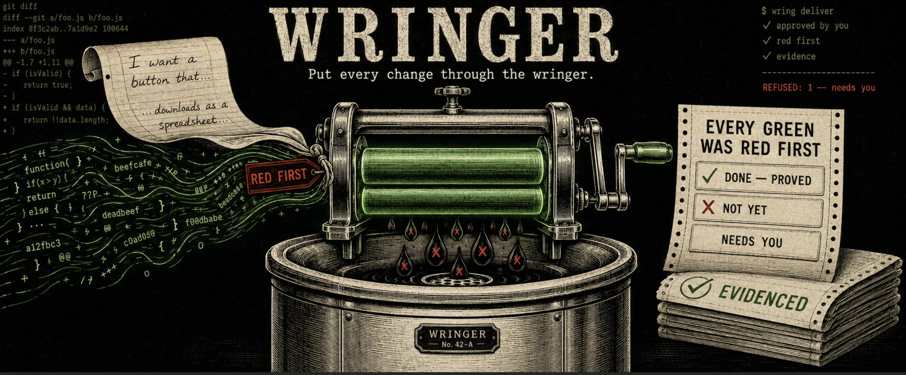

# Wringer



**Coding agents write the change. Wringer coordinates the engineering around it.**

Wringer runs bounded repair loops with independent checks and review, carries
portable evidence with the result, and measures proposed improvements before
selecting them for future work. Keep your coding agent; give its work an
inspectable plan, a finite allowance and a durable history.

```text
request → approved plan → worker → protected checks → independent judge
                            ↑           │                   │
                            └── bounded repair ─────────────┘
                                                            ↓
                            result review → separate Send → portable evidence

development failures → predicted improvement → fixed comparison → future adoption
```

## What makes Wringer useful

| Capability | What you can inspect |
| --- | --- |
| **An engineering loop, not just a final answer** | Candidate trees, check and judge outcomes, repair evidence, charged attempts and the reason work continued or stopped. An exact repeat of unsuccessful work stops; repeated outcomes warn without pretending to measure quality. |
| **Independent execution and review** | Separate worker and judge sessions/storage, protected acceptance inputs and Apple Container or gVisor/Kubernetes execution. ACP connects the agent; the sandbox establishes the execution boundary. |
| **Evidence that travels with the change** | Versioned records, source identities, check receipts, loop decisions and human observations. A fresh clone can audit a delivery without the original controller or provider account. |
| **Measured improvement for future work** | Register a prediction and comparison before trials, keep failures in the denominator, and explicitly adopt or undo a qualified worker playbook. A suggestion cannot grade or approve itself. |
| **Durable, bounded work** | One allowance covers the journey. Resume retains reservations and reconciles uncertain effects; it does not silently buy another attempt. |

Explore [loops and inspection](docs/native/LOOP_INSPECTION.md),
[portable evidence](examples/evidence/README.md),
[prediction-gated improvements](docs/native/EXPERIMENTS.md) and
[the execution architecture](docs/REWRITE_PLAN.md).

**The platform direction is composable workflows that improve through evidence.**
Contained graph execution, bounded parallel branches, gate/workflow proposals,
candidate tournaments, Temporal and A2A are the ordered next steps in the
[restoration plan](docs/SOTA_RESTORATION_PLAN.md). Their exact current status is
listed in [capabilities](docs/CAPABILITIES.md); planned features are not release
claims. Public graph execution is currently retired.

## Start with your existing coding app

- **Check existing work:** keep Claude Code, Codex or another coding assistant.
  Wringer runs reviewed repository checks locally. No worker account, image or
  extra model call is needed. These commands have your host permissions.
- **Delegate work:** select worker and judge models explicitly, provision Apple
  Container or gVisor Kubernetes, and approve a finite job. Missing containment
  stops delegation. Model/provider billing is separate from the assistant chat.

Start with [installation](INSTALL.md), then try the labelled, no-model simulation:

```sh
wring demo --json
wring setup --repo /absolute/path/to/project --client codex --mode verification --dry-run --json
```

Inspect the proposed changes, apply the selected setup, and use
`wring job new` and `wring job open` to review a job. The
[local bug-fix example](examples/adoption/local-fix/README.md) includes a failing
check, a correction and source-bound evidence. [Agent](docs/START_AGENT.md),
[PM](docs/START_PM.md) and [operator](docs/START_OPERATOR.md) guides describe the
next steps. [CLI reference](docs/CLI.md) lists the actual commands.

## Inspect the work

For a prepared delegation job:

```sh
wring job loop --job JOB_ID --json
```

The job page shows the same loop observations. Connected delegation clients can
use the read-only `wringer.inspect_loop` tool. For an existing contained delivery:

```sh
wring bundle export --bundle PATH_TO_DELIVERY --output NEW_DIRECTORY
node NEW_DIRECTORY/read-bundle.mjs NEW_DIRECTORY
wring bundle inspect --bundle NEW_DIRECTORY
```

The Node-only reader checks carried byte integrity and displays recorded facts.
`bundle inspect` also performs Wringer's semantic audit. Neither executes the
acceptance checks again or supplies a human verdict. Unknown provider cost stays
unknown, and fixture success is not a measured live improvement.

## Release and evidence

**Engineering prerelease.** Native archives are published through
[GitHub Releases](https://github.com/marcoakes/wringer/releases). Each release
requires green native macOS arm64 and Linux x64 CI, including extracted archive
and installer checks; inspect its attached claim reports for measured coverage.
Windows is not a release target. Claude Code and Codex scoped adapters are implemented; complete
live journeys and Codex desktop remain unmeasured. See
[compatibility](docs/ASSISTANT_COMPATIBILITY.md) and [evidence](EVIDENCE.md).

Approval, result acceptance and Send are separate. The local review page uses
cooperative trust: another unrestricted process under your OS identity could
impersonate its operator. Protected mode remains unavailable. Read the
[security boundary](SECURITY.md) before using valuable source or credentials.

[Support](SUPPORT.md) · [Contributing](CONTRIBUTING.md) · [Apache-2.0](LICENSE)

Created and directed by [Marc Oakes](https://github.com/marcoakes).
