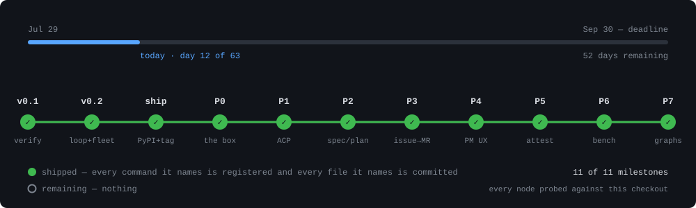

# Roadmap — the 90-day compression

*Adopted 2026-07-29 after external design review. This document governs
execution order. The [full build plan](wringer-ai-dlc-harness-plan.md)
remains the architectural north star — we are shipping it inside-out:
the differentiated core first (loop contracts, deterministic gates,
worker/judge isolation), the undifferentiated plumbing (multi-cloud
adapters, gateway planes, policy hooks) deferred until the loop exists
and pulled by demand rather than pushed by plan.*

**Hard deadline: `v0.1.0`, first installable release, September 30, 2026.**

## Where this actually is

<div align="center">



</div>

**Read the count off the picture, not off this sentence.** It said "nine of
ten shipped" for weeks after the rail had grown to eighteen nodes, which is a
hand-kept number doing what hand-kept numbers do. `v0.1.0` cleared its own
release bar on July 31 — two months early — so the deadline above is met and
the arc kept going: the loop, the fleet, the judge, the box, the ACP seam,
the front door, issue→MR, provenance, the guided launch, bench, graphs and
health. The rail then grew a second block (F1–F6) that measures the FACTORY
rather than the feature list, because every node in the first block was green
while a PM's spec was no closer to becoming working software.

| # | milestone | what it shipped |
|---|---|---|
| 1 | **v0.1** | `wring init` · `verify` · `explain` — the standalone evidence compiler |
| 2 | **v0.2** | `run` · `resume` · `fleet` · `judge` — the loop, supervised |
| 3 | **ship** | `v0.1.0` and `v0.2.0` on PyPI, published by OIDC; no token was ever held |
| 4 | **P0** | the OCI image, `wring doctor`, and SETUP.md as a runbook an agent follows |
| 5 | **P1** | the ACP worker seam — Wringer is the client, never the agent |
| 6 | **P2** | `wring spec` · `plan` — a PRD in, a spec a human approves |
| 7 | **P3** | `wring get` · `issue` · `deliver` — the amended law 6 and its five refusals |
| 8 | **P4** | `wring start` — the guided launch, and the credential ruling |
| 9 | **P5** | `wring attest` · `audit` · `verify --prove` — provenance and vacuity |
| 10 | **P6** | `wring bench` — same job, N workers, one comparison, and no winner |
| 11 | **P7** | `wring graph` — loops composed into a resumable, evidence-driven workflow |
| 12 | **P8** | `wring health` — can each gate still fail? read across the whole record |
| 13 | **F1** | a parked graph stops charging a human for thinking |
| 14 | **F2** | gate authoring — a criterion becomes a proposed gate, red before anyone builds |
| 15 | **F3** | brief quality — measured, and what the worker is actually told |
| 16 | **F4** | the chain driven end to end on a real feature, reaching `wring deliver` |
| — | **F5** | multi-repo — **not built**: "repositories" is plural in the goal and singular in the code |
| — | **F6** | environment ≠ repair — **not built**: a missing dependency is not a job for a worker |

The F block is the one that matters, and it is newer than the rest. Nodes 1–12
are Wringer getting better at REFUSING; the goal is a PM's spec becoming
working software, and `~/Claude/WRINGER_FACTORY.md` is where the ordering
between them is decided.

**That picture is generated, not drawn.** Every node carries a probe — the
commands it claims must be registered in the parser, the files it claims must
be committed, the tags it claims must exist — and `tests/test_docs.py` runs
those same probes, so a milestone that stops being true fails the suite rather
than ageing quietly on an image. A roadmap is the easiest document in a
repository to lie with, and this is a repository whose product is evidence.

```bash
python3 scripts/roadmap_render.py docs/roadmap.svg 2026-08-10
```

The date is an argument rather than `date.today()`: a file that rewrites
itself on every run has a diff nobody can read.

**Outside the rail, and Marc's own:** the launch assets — a demo GIF and the
Show HN write-up of the eight-hour unsupervised-fleet incident that produced
[SPEC_SUPERVISION_V0.md](SPEC_SUPERVISION_V0.md). Neither is blocked on code.

## The 90-day arc

### Days 1–30 — v0.1.0, the standalone evidence compiler

⚠️ **Superseded in detail by [SPEC_VERIFY_V0.md](SPEC_VERIFY_V0.md)**
(third external review, 2026-07-30) — the binding implementation
contract. The essence: **`wring verify` ships first as a standalone
evidence compiler**, before `wring run`, before the graph IR, before
judges, before agents. One command that proves whether a change is
mergeable and leaves behind evidence a human or agent can inspect.

- `wring init` — detect project commands, write `.wringer.yaml`.
- `wring verify` — run declared gates in order, write the evidence bundle
  (`manifest.json`, `evidence.jsonl`, `summary.md`, `diff.patch`, gate
  logs). Exit codes are contract. `--json` for agent consumption.
- `wring explain` — compact non-LLM diagnosis of the latest failed run.
- Five-day build order + the "Definition of PROVEN" release bar (CI runs
  `wring verify` on this repo; a sanitized demo bundle is committed; the
  README transcript is real) — all in the spec.

**The release bar is one line from true** — everything except the PyPI
publish is done and committed (see the spec's
[Definition of PROVEN](SPEC_VERIFY_V0.md#definition-of-proven--the-repo-must-show-its-own-receipts)).
**v0.1.0 tags when that last line is true** — well before
the Sept 30 outer deadline if the bolts land clean.

**After v0.1.0 (v0.2, inside the 90 days) — the loop closes around it:**

- `wring run` = a loop that keeps calling `wring verify` until the evidence
  says stop. Minimal single-loop IR (`loop:repair`), in-memory engine.
- Worker binding = **your existing coding agent via subprocess** (Claude
  Code first; Codex/Gemini CLI next; ACP as the formal wire later).
- One rubric judge via any OpenAI-compatible endpoint (Ollama works);
  dry-run mode keeps demos and CI at zero LLM spend.
- Issue → branch + MR + evidence delivery.

Cut from this slice: graph orchestration, fan-out/fan-in, human interrupt
nodes, all cloud adapters, Cedar/OPA, AGENTS.md autogen, skills registry.

### Days 31–60 — durable execution & anti-thrash

⚠️ **Governed by [SPEC_SUPERVISION_V0.md](SPEC_SUPERVISION_V0.md)**
(adopted 2026-07-31 after a live incident during Wringer's own development
proved the failure modes) — binding invariants for every execution
primitive: bounded retries with escalation, failure-signature breakers,
deadlines everywhere, progress measured in evidence, resume from the
ledger, honest partial success. Slices: S1 breaker + wall-clock in the
loop, S2 `wring resume`, S3 `wring fleet` (hundreds of queued tasks,
bounded concurrency, self-healing ladder, parked-work queue).

- Event-sourced engine: the append-only ledgers Wringer already writes,
  replayed — crash on iteration 4 of 6, `wring resume` continues exactly
  there. (SQLite deferred until the JSONL ledgers prove insufficient.)
- Anti-thrash: failure-signature hashing + oscillation detection (a
  signature seen before in the loop trips the breaker), plateau detection
  (shipped in v0.2 slice 1 as the fingerprint).
- Cost ledger per loop/run (`cost.jsonl` beside the evidence bundle) —
  recording what is known, declaring what is not.
- OpenTelemetry GenAI spans for worker and judge — "audit trail as
  byproduct" made real.

### Days 61–90 — the "graph of loops" demo

- `@wringer/ir` v0.2 — a linear chain of loops: scope → plan → repair →
  deliver, with typed edges and explicit feedback paths.
- One `human` interrupt node: pause + webhook/Slack message, resume via
  `wring approve <run-id>`.
- **The credibility moment: Wringer ships a Wringer PR.** Dogfooded,
  with the full evidence bundle and cost ledger in the PR description.
- 5-minute demo video: issue → scope → plan → 3 repair iterations with
  gate failures → human approval → merged MR with evidence.

## OKRs

**Q3 2026:** Wringer reliably turns a GitHub issue into a passing MR for
**Python repos** under **$2.00** in LLM spend. (`v0.1.0` ships Sept 30.)

**Q4 2026:** TypeScript target repos + the **Temporal** runtime adapter.

## Rulings that changed from the v1.0 plan

- **One hero runtime adapter, not five.** Temporal first — open source,
  widely deployed, and its durable-execution model matches the
  event-sourced engine. AgentCore / Agent Engine / Foundry / Anthropic
  Managed Agents adapters are deferred until the conformance suite exists
  and someone actually asks; the plan's §5 layout keeps their seats.
- **Phases 3–7 of the plan's §6 are deferred**, not deleted — gateway
  plane, policy hooks, context autogen, skills registry, self-evolution
  all wait behind a working, dogfooded loop.
- **v0 implementation is Python** (third review, 2026-07-30: ubiquitous,
  inspectable, `pipx`-installable, right audience — see
  [SPEC_VERIFY_V0.md](SPEC_VERIFY_V0.md)). This supersedes the
  earlier TypeScript-first ruling for v0.1; the TS monorepo remains the
  plan's shape for the later graph engine — revisit at v0.2. Python
  repos are also the first *target* ecosystem (Q3 OKR).

## Risks

| Risk | Mitigation |
|---|---|
| Incumbents (LangGraph, Agent Framework) absorb loop contracts | Ship first; the moat is the verification-first implementation — gates before judges, physical worker/judge isolation |
| No contributors show up | The loop-contract schema is a standalone spec (RFC issues open now); schema adoption wins standards gravity even without the engine |
| Multi-cloud adapters too costly | Deferred; local + Temporal covers most of the durable-execution need |
| LLM costs make demos expensive | Dry-run mode + local models (Ollama) for development |
