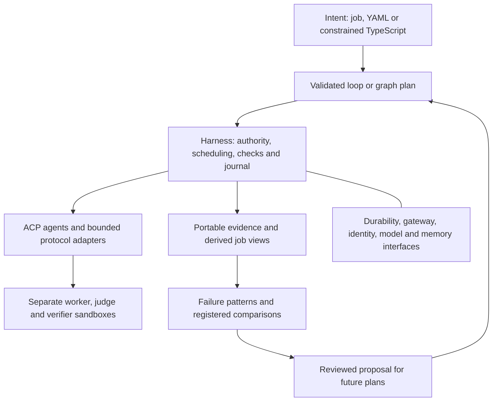

# Restore Wringer's orchestration and improvement platform

Plan · 29 September 2026 · baseline: `1.0.0-alpha.23`, commit
`69f0f304153560861a7f0ecf671eb564f7dae082`

**Status: proposed work, not an implementation or a performance claim.** This
plan responds to the supplied appraisal. Its recommendations are evaluated
against the repository; they are not treated as execution instructions.

Execution was authorised on 29 September 2026. Follow the
[execution record](restoration/STATUS.md) for completed work and release evidence;
the design below does not itself claim completion.

## 1. Product decision

Wringer should make **composable, bounded agent work and measured improvement**
its central product. Keep the installer, simple job entry point, containment and
review flow. Make the loops, orchestration and learning visible through that
same entry point and through portable contracts.

The intended experience is: give Wringer a difficult change; inspect its plan;
let it coordinate isolated work within an allowance; see why each attempt
continued or stopped; inspect a tested result and its evidence; then use failures
to propose and measure a better approach for future work.

The appraisal is right that the platform story has become hard to find. Its
claim that most of the underlying machinery disappeared is not supported by the
source. Rebuilding that machinery from scratch would discard useful work. The
plan restores the complete path in releases, starting with existing capabilities,
then contained graph execution, broader improvement proposals, candidate
competition and a second durable runtime. It does not defer the platform to an
unspecified v2.

## 2. What is actually present

| Appraisal concern | Observed alpha.23 position | Required work |
| --- | --- | --- |
| First-class loops disappeared | `wring run` and `resume` remain. Contained loops retain check/judge decisions, budgets, comparable failure signatures and repeat detection. Repeated outcomes warn; they are not proof of a plateau. | Make those facts a coherent, discoverable part of each job and its public API. |
| Graphs disappeared | `graph show/status/explain` exist. Public execution is retired; the internal historical scheduler remains. This retirement already existed at the pre-rebuild baseline. | Build a graph executor over the contained lifecycle. Do not reactivate the old host execution route. |
| Portable evidence disappeared | Versioned schemas, evidence manifests, logs, summaries, portable delivery, offline audits and falsification remain. Release claim reports serve a different purpose. | Document the supported bundle families, provide a stable discovery envelope and prove an independent reader can consume them. |
| Self-evolution disappeared | Experiments already register predictions, collect bounded comparisons, evaluate results and adopt/undo a worker playbook for future plans. Development failure patterns and contained proposals exist. A PM improvement card also exists. | Connect this path to ordinary workspace jobs, measure live benefit, then extend proposal scope to gates/workflows with separate evaluation contracts. |
| Native binaries imply local-only execution | Apple container and gVisor/Kubernetes execution adapters exist. No current Temporal workflow adapter was found. The retained workflow journal is not established to be a SQLite workflow engine. | Separate sandbox choice from workflow durability. Add a second durable backend with conformance evidence. |
| Tournament/multiverse disappeared | No current complete tournament, prosecutor and cross-candidate replication system was found. | Build a finite competition policy on contained graph branches; measure whether it improves outcomes enough to justify its cost. |
| Five-layer architecture disappeared | ACP, MCP, runtime adapters and separate worker/judge roles remain. A2A and a complete set of interchangeable platform services are not established implementations. | Clarify existing boundaries and add adapters where a concrete workflow and a second implementation justify them. |

The pre-rebuild reference is commit
`7f4cc542fd1149c00a3be0ee8949c895b95ef0c3`. Comparing it with the baseline above
found no changes in the loop-analysis, experiments, experiment-collection or
improvement source files; the scheduler changes were package versioning.
Historical ambitions and implemented features must remain separate in the public
capability map. Further Git archaeology may locate reusable earlier prototypes;
their existence would not by itself qualify them for public execution.

Evidence inspected includes [loop analysis](../packages/workflow/src/loop-analysis.ts),
[measured loops](native/MEASURED_LOOPS.md), [experiments](native/EXPERIMENTS.md),
[improvements](../packages/application/src/improvements.ts),
[the historical scheduler](../packages/scheduler/README.md),
[CLI routing](../packages/cli/src/extended.ts),
[portable delivery](../packages/delivery/src/contained.ts),
[a published schema](../schema/loop-decision-v1.schema.json),
[ACP interfaces](../packages/acp/src/index.ts), [MCP](../packages/mcp/README.md), and
[runtime adapters](../packages/runtime/src/adapters.ts).

On 29 September, the existing loop-engineering, experiments and improvements
test files produced **38 pass, 0 fail, 243 assertions**. These are local fixture
results, not new CI results, live agent results or an efficacy benchmark. The
reproduction command and output are recorded in section 8.

## 3. Architecture to preserve and extend

Keep one Bun/TypeScript harness, one versioned execution-plan family and one
shared lifecycle for CLI, PM views and MCP. An agent runtime owns its reasoning
and tool loop. Wringer owns orchestration, budgets, checks, records and delivery.



The diagram is the target composition, not a claim that every adapter exists.

- **Intent:** simple jobs remain the default interface; advanced users can author
  loops and graphs. Both compile to validated data. Never execute a repository's
  TypeScript declaration with host privileges.
- **Harness:** contained loops are executable leaves of a graph. Root allowances
  cover children, retries, judges, integration and research where explicitly
  granted. Concurrency limits do not substitute for aggregate budget limits.
- **Wires:** preserve ACP for agent sessions and MCP for bounded product tools.
  A2A adds an optional external task boundary later. Protocol support never
  establishes containment, trustworthy identity or authority by itself.
- **Services:** distinguish workflow durability from sandbox execution and from
  artifact platform. Select model/adapter and policy before approval. Memory
  means explicit, versioned, provenance-bearing context with bounded access;
  it must not become mutable shared worker/judge or training/holdout state.
- **Sandbox:** use the existing Apple/gVisor contracts, isolated writable state
  and repository transport. Preserve source-bound human review and separate Send.

Graph nodes exchange typed references to exact source trees, evidence and
decisions. A dependency does not automatically merge code. An integrated result
is a new candidate requiring its own checks and judge observation.

Resume means reconciliation from a valid durable checkpoint with remaining
authority. Inspecting old iterations is read-only. Retrying or branching from
an earlier candidate must create explicit lineage and obtain any additional
authority; it must not erase spend or replay uncertain external effects.

## 4. Ordered release plan

Each numbered phase below ships as its own release. Allocate version numbers
when implementation begins. Start every phase by measuring its actual public
path before finalising its contracts. Observe every CI job on every push green,
and verify the phase's release, before beginning the next phase. This planning
task does not start that release sequence.

### Phase 1 — Make loops and portable evidence first-class again

**User outcome:** from a normal job, see every repair attempt, the reason it
continued or stopped, and an export another machine can inspect.

**Measure first:** trace one existing delegation job through its controller,
loop decisions and delivery bundle. Compare CLI, job page and offline audit;
record missing facts, manual steps and any disagreements. Verify packaged help
against source, not just README wording.

**Implement:** use one derived projection for CLI, PM and MCP. Show candidate
lineage, check/judge outcomes, actual repair evidence, remaining allowance,
uncertain reservations and stop/warning explanations. Keep the next action
prominent; make the timeline directly accessible. Expose existing functionality
before inventing new commands. Update README, roadmap, examples and capability
status together, keeping historical reports dated.

Publish a bundle index/envelope only where existing formats lack common
discovery. It references existing immutable records, schema versions, content
digests and named omissions; it does not replace or reinterpret frozen formats.
Provide a small independent reader example using the published contract, plus
an export containing the necessary portable evidence and readable summary.

**Release gate:** the packaged product demonstrates success, failed repair,
repeat-stop, repeated-outcome warning and interrupted-resume histories. Views
agree on the same records. A fresh clone with no credentials, controller state,
model or network can inspect and audit its carried evidence. Missing records,
altered hashes and mixed source revisions are detected. Historical bundles
retain their previous meaning. This release claims visibility and portability,
not improved agent quality.

### Phase 2 — Make existing measured improvement usable from ordinary jobs

**User outcome:** select a recurring failure, inspect one predicted improvement,
compare it fairly, and explicitly adopt or undo it for future work.

**Measure first:** complete the existing experiment/card flow with fixtures,
starting from the new workspace job interface. Record every required path,
controller identifier and manual connection. Inspect current applicability
checks: source, runtime, model and check-family binding are intentionally narrow.

**Implement:** connect workspace jobs to the existing experiment service and
card; remove avoidable operator plumbing without hiding the finite research
allowance. Preserve register → predict → collect → evaluate → adopt/undo.
Show failures, unknown costs and missing trials alongside successes. Provide a
reviewable proposal artifact and exact applicability conditions. Make it clear
when a source change requires new evidence rather than promising universal
learning from a repository-specific result.

**Release gate:** a deterministic walkthrough exercises the complete path, with
fixture labels preserved. Holdout feedback cannot enter proposal inputs;
fixture benefit cannot qualify for adoption; an active plan never changes after
future adoption; stale evidence and incomplete trials cannot qualify. With a
separately authorised live comparison, publish the observed result, including
no benefit if that is what happens. Without it, the live-benefit claim remains
unmeasured. No background spending is enabled by installing this release.

### Phase 3 — Execute serial graphs using contained loops

**User outcome:** express scope → implementation → review → human decision →
delivery as one inspectable, resumable workflow.

**Measure first:** document the old scheduler's host execution, state and source
handoff assumptions. Reuse validators/readers where compatible; enumerate the
incompatible semantics before designing the new graph version.

**Implement:** add a versioned graph contract and compiler with typed inputs,
outputs and branch outcomes. Start with contained-loop, deterministic-check,
router, human-hold and delivery nodes. Use existing contained execution for
every executable leaf. Pin the graph, sources and acceptance before granting
execution. The graph is acyclic; bounded iteration lives inside a loop node.
Persist node identity, decisions and effect reservations in the durable record.
Route production execution through the new implementation, retaining historical
readers and explicit refusals for unsupported old execution formats.

**Release gate:** a packaged three-stage workflow completes with carried
evidence. Kill/restart probes cover pre-dispatch, reserved/dispatched but
uncertain work, completed child before parent acknowledgement, human hold and
delivery reconciliation. None silently reissues a paid call or Send. Invalid
edges/cycles and forged or stale decisions are rejected before execution.
Serial graph execution becomes public only when these gates pass.

### Phase 4 — Add bounded fan-out, fan-in and integration

**User outcome:** divide a change into independent work, run bounded branches,
then obtain one checked integrated result.

**Measure first:** compare serial execution with two independent branches in a
fixture repository, including overlapping edits. Measure scheduler overhead,
isolation, resource usage and failure recovery before setting parallel limits.

**Implement:** explicit fork/join contracts, a fixed branch roster, maximum
parallelism and aggregate reservations including integration and retries.
Use isolated clones and role state. Define deterministic dependency/selection
rules and separate wait-all, failed-branch and cancellation outcomes. A join
cannot turn a failed requirement green. Integrate changes in a separate
contained candidate; conflicts produce bounded repair or an explicit hold.
Start with one repository per graph. Multi-repository delivery requires its own
later transaction contract, not an implied consequence of DAG support.

**Release gate:** two independent changes integrate and pass fresh checks;
conflicting changes cannot be silently combined. Lost, duplicated and reordered
completions, exhausted aggregate allowance and restart during a join preserve
accounting and source lineage. Branches cannot read each other's private state.
Report fixture throughput separately from live benefit.

### Phase 5 — Extend self-evolution to gates and workflow proposals

**User outcome:** failures can produce a reviewable improvement to how Wringer
checks or coordinates work, with a prediction and measured comparison attached.

**Measure first:** choose representative development failures where a new check
or workflow change could help. Record what the current playbook-only comparison
cannot express. A candidate gate changing the evaluator cannot be evaluated by
pretending it is the existing one-variable playbook experiment.

**Implement:** sibling experiment contracts for gate and workflow proposals.
Freeze an independent evaluator, known-defect corpus, passing controls, hidden
cases, prediction, sample/order and budgets before trials. Run proposals in
scratch clones. Measure missed defects, false positives, accepted completion,
latency and intervention cost. For gate changes, measure against the fixed
external oracle, not the candidate's own pass rate. Candidate checks remain
advisory until separately reviewed and adopted.

Produce an ordinary source PR, when publication is authorised, containing the
diff, prediction, results, scope limits and rollback. Never change the active
grader or promote code into the engine through the playbook registry. Harness,
policy and evaluator code changes take the normal source-review/release path.
Retain the separate future-only playbook adoption path from phase 2.

**Release gate:** a deliberately weakened gate can look greener but fails the
independent comparison; a noisy gate exposes false positives; a useful gate
detects seeded defects without invalidating passing controls. Holdout leakage,
failed predictions and incomplete evidence prevent qualification. Proposal,
evaluation, publication and adoption remain separate recorded actions.

### Phase 6 — Add a measured tournament and prosecutor

**User outcome:** for tasks that justify the expense, compare a small number of
independent implementations and try to falsify the apparent winner.

**Measure first:** compare one candidate with a fixed small number of candidates
on the same task family. Include all worker, judge, prosecutor and integration
resources. Establish the single-candidate result before claiming a tournament
advantage. Independence of storage does not establish independent model errors.

**Implement:** a finite graph policy, not an unbounded fleet. Freeze candidate
count, selection rules, checks, roles and aggregate allowance. The prosecutor
proposes executable counterexamples in a separate sandbox. Validate each
counterexample against trusted requirements and controls; then freeze and run
the same challenge against every candidate. Cross-candidate replication means
reproducing a defect on exact candidate trees, not sharing private reasoning or
accepting a majority vote. Keep a final untouched evaluator for assessment.

Select only among qualified candidates; retain a legitimate no-winner outcome.
Expose candidate lineage, disqualifications, challenge results and total cost.
Do not assume apparent role diversity eliminates correlated mistakes.

**Release gate:** fixtures include a persuasive but wrong candidate, a spurious
prosecutor test, a real cross-candidate defect, ties and no valid candidate.
Verify fairness under branch order changes and the same restart/budget rules as
phase 4. A registered live comparison must justify any recommendation or default
enablement. Otherwise ship the mechanism as experimental with the negative or
inconclusive result visible.

### Phase 7 — Add a second durable runtime with honest conformance

**User outcome:** run the same supported workflow contract with local durability
or a long-lived distributed controller, preserving inspectability and recovery.

**Measure first:** map which existing orchestration operations are deterministic
decisions and which perform external effects. Prototype SDK compatibility and
recovery against a local Temporal service before committing to packaging or
Cloud deployment. Keep the existing journal backend; SQLite is not a prerequisite.

**Implement:** a durability interface with both the current local implementation
and a Temporal adapter. Keep agent calls, filesystem/network work and publication
outside deterministic workflow code. Persist effect identities and reconcile
uncertain outcomes; retries must not imply exactly-once external effects.
Version workflow code and exercise upgrades of retained histories.

The official TypeScript SDK currently documents Node workers and does not
support Bun workers. The proposed packaging is therefore an optional Node-based
Temporal adapter worker, with the Bun harness and local install unchanged; pin
and test the released SDK before adopting that design. This is an adapter,
not a second implementation of the harness. See the [SDK support guidance](https://github.com/temporalio/sdk-typescript),
[workflow determinism rules](https://docs.temporal.io/workflow-definition) and
[Temporal's idempotency discussion](https://temporal.io/blog/idempotency-and-durable-execution).

**Release gate:** run the same captured observations through both backends and
compare canonical policy decisions, budget transitions and semantic outcomes.
Test worker loss, duplicate delivery, timeout, cancellation, version upgrade and
human holds. Identical recorded inputs and logical IDs may yield byte-identical
canonical records; independent live runs need not have identical bundles.
Preserve real timestamps, host/runtime provenance and external outputs rather
than erasing differences to pass a hash check. Keep containment tests separate.
Temporal Cloud remains a deployment qualification requiring its own access and
live evidence, not a claim inferred from local-service tests.

### Phase 8 — Complete the useful platform interfaces

**User outcome:** compose Wringer with an external task service and change
supported providers without changing the meaning of authority or evidence.

**Measure first:** choose one concrete external task integration. Write the
capability and failure matrix for existing ACP/MCP and the selected A2A peer.
Inventory actual runtime, gateway, identity, model and memory dependencies;
do not build a provider marketplace in advance of a working use case.

**Implement:** a bounded A2A adapter mapping tasks, artifacts, status and
cancellation to graph nodes. Require pinned, allowlisted endpoints and validated
artifact provenance. Neither an Agent Card nor an external completion claim can
grant access or count as acceptance. Keep external delegation distinct from
running a locally contained ACP agent. Publish interface/conformance contracts
for the service boundaries actually exercised; mark the rest explicitly pending.

Follow the official [ACP lifecycle](https://agentclientprotocol.com/protocol/v1/overview)
and [A2A specification](https://a2a-protocol.org/latest/specification/), pinning
supported versions and negotiated capabilities. Maintain MCP's restricted
inspection/action surface; do not add a backdoor approval tool.

**Release gate:** a real peer completes a bounded task; cancellation, unavailable
peer, duplicate response, changed identity and malformed artifact produce the
documented outcomes. Local fake peers establish only fixture conformance. Claim
interchangeability for a service only after two implementations pass the same
contract. ACP file/terminal callbacks remain within the assigned sandbox.

### Phase 9 — Qualify the complete product and publish the evidence

**User outcome:** a demonstrably useful platform, with clear evidence of when its
orchestration, improvement and competition features help.

Use the qualification design in [the rewrite plan](REWRITE_PLAN.md) as a starting
point: a pilot of 20 bounded tasks across three repositories. Include ordinary
repairs, serial dependencies, parallel integration, interruptions, human review
and adversarial candidates. This is a proposed pilot, not a powered universal
benchmark or a result already achieved.

Compare the same pinned builder/model and task/check inputs with and without
Wringer orchestration. Use equal total resource ceilings and report actual
usage. Add separate applicable comparisons for single-loop versus graph,
single-candidate versus tournament, and baseline versus adopted playbook/gate.
Do not credit every improvement to every feature or change the evaluator between
arms. Run sandbox/backend conformance as a separate matrix.

Publish accepted outcomes and all attempted-task denominators, requirement
failures, active human minutes, intervention counts, wall time, role calls,
measured billing where available, recovery outcomes and fresh-clone audit results.
Unknown costs remain unknown. Include failures, missing trials and inconclusive
results. Average repeated observations within the task; do not count repetitions
of one task as independent tasks. Obtain actual independent human observations
for usability claims; scripted clicks and an assistant's review do not supply them.

Use pilot variance to design a new fixed, untouched comparison. Register the
primary endpoint, minimum useful effect, sample size, regression limits and
uncertainty rule before evaluation. Do not enlarge the sample after viewing
results to rescue a failed prediction. The rewrite plan's earlier targets remain
targets, not measured improvements. A small pilot may support a narrow result
but cannot establish general state-of-the-art performance.

**Release gate:** a reproducible showcase carries the graph, all candidate and
integration evidence, a restart demonstration, a source-bound review/delivery,
an offline audit and a future-improvement proposal with comparison results.
Publish a capability ledger that distinguishes implemented, fixture-tested,
live-qualified and comparatively beneficial. Advanced mechanisms can remain
experimental if their benefit is unproved. Use “SOTA” only with a named workload,
fair contemporary baselines and adequate public results supporting that claim.

## 5. Implementation ownership and dependencies

These are proposed changes to existing packages, not new files asserted to exist.

| Area | Reuse | Add or extend |
| --- | --- | --- |
| Plans/contracts | `packages/plan`, `packages/records`, frozen `schema/` corpus | Versioned graph/edge contracts, bundle discovery and new experiment kinds |
| Loop execution | `packages/workflow/src/contained.ts`, `loop-analysis.ts`, journals and query projection | Shared visible history, contained child lifecycle and durability boundary |
| Graph scheduling | `packages/scheduler` readers/validators | A new contained executor, root accounting, fork/join and integration semantics |
| Product entry points | `packages/application/src/delegation-jobs.ts`, experiment/improvement services, `packages/board`, `packages/cli`, `packages/mcp` | Job-to-run/graph/experiment navigation from shared projections |
| Evidence/delivery | `packages/delivery`, canonical records, existing audit/falsification | Graph/child lineage, export discovery, independent reader and comparison reporting |
| Execution/protocol adapters | `packages/runtime`, `packages/acp`, `packages/mcp` | Versioned conformance suite, optional Temporal worker and bounded A2A adapter |

Release order is deliberate: phases 1–2 restore visible depth using existing
mechanisms; phases 3–4 provide the composition foundation; phase 5 broadens
measured improvement; phase 6 uses graph branches for competition; phases 7–8
prove portability; phase 9 qualifies the integrated product. Qualification
fixtures and measurement instrumentation are built in each phase, not postponed
until phase 9. No calendar or staffing estimate is inferred from the appraisal;
estimate the next phase after measuring its integration points.

## 6. Engineering and release discipline

For every fix and guard, retain a red-first case that fails for the intended
reason. Implement the change, observe green, then remove only that fix/guard in
an isolated scratch copy and observe the targeted test go red. Restore it and
observe green again. Repeat individually; keep the command, result, source
identity and reason in the phase evidence. A syntax error or absent dependency
is not a successful revert-red-watch of the intended behavior.

Example falsifications to preserve throughout the sequence:

- Remove decision coverage: a fabricated successful history must fail audit.
- Remove aggregate reservation: concurrent children must trigger the budget test.
- Remove deduplication/reconciliation: a crash probe must detect duplicate effect
  dispatch rather than merely assert that resume returned a value.
- Remove holdout separation or future-only selection: a leakage/active-plan test
  must fail.
- Let a proposed gate grade itself or let a tournament majority override checks:
  the deliberately wrong candidate must be detected.
- Erase backend provenance or accept an unauthorised remote artifact: conformance
  must fail rather than silently normalise the discrepancy away.

Run the repository's required check/build/validation and relevant packaged,
platform and compatibility tests. Keep frozen schemas unchanged; add siblings
or versions and maintain negative historical cases. Check available disk before
phases and retain failed measurements without pruning unrelated work.

After **every push**, enumerate all triggered workflows and every job, wait for
terminal results and inspect failures. A green aggregate or a successful watcher
exit is not sufficient evidence on its own. No next phase while any required job
is red, pending, cancelled or absent. Observe release/tag workflows too, record
exact SHAs/artifact hashes and verify the published installation for that phase.
Do not rewrite tags or use green local tests as a substitute for remote CI.

Engineering reviews must be identified as such. Real human acceptance, logins,
keys, external merges and publication authority remain the appropriate person's
acts. The earlier end-to-end instruction removes routine phase permission
questions; it does not allow an assistant to fabricate those acts. Live spending
or parallel agent execution needs explicit scope and finite allowance. Existing
no-model-call/no-fleet restrictions remain in force for present work; a plan
describing future capabilities does not grant permission to run them.

## 7. Definition of restored product value

The restoration is complete when a user can compose contained work, understand
every consequential decision, recover without accidental duplicate effects,
export evidence another machine can inspect, compare a proposed improvement
fairly and apply a reviewed result to future work. The advanced showcase adds
independent candidates, validated adversarial checks and a second durable
backend to that same path.

Feature presence and superiority are separate deliverables. A failed or
inconclusive comparison must remain visible and may keep a feature experimental.
The product earns its differentiation through useful completed work, lower
measured supervision and trustworthy improvement evidence—not the number of
architecture boxes, additional refusals or a larger test count.

**First implementation slice:** open an existing workspace job, follow its
contained-run history, export and independently audit its evidence, then reach
its existing experiment flow without manually discovering private controller
paths. This establishes the product surface that every later phase will reuse.

## 8. Measurement record for this plan

Read-only source/history inspection and these deterministic tests informed this
plan. No live agent comparison, fleet, provider call, remote publication or human
acceptance was performed by this planning task.

```sh
bun test packages/workflow/test/loop-engineering.test.ts \
  packages/application/test/experiments.test.ts \
  packages/application/test/improvements.test.ts
```

Observed on the baseline source above:

```text
38 pass
0 fail
243 expect() calls
Ran 38 tests across 3 files. [6.98s]
```

The local, ignored diagnostic log is
`build/restoration-appraisal-2026-09-29/preserved-capabilities.log`. The exact
command and result are included here so this plan does not require that private
working directory to remain available. Existing implementation guides and
source links above explain what those tests cover and where live proof is still
required.
